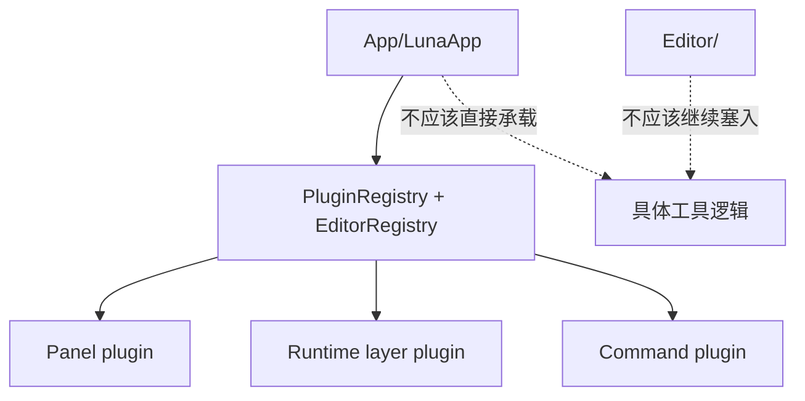
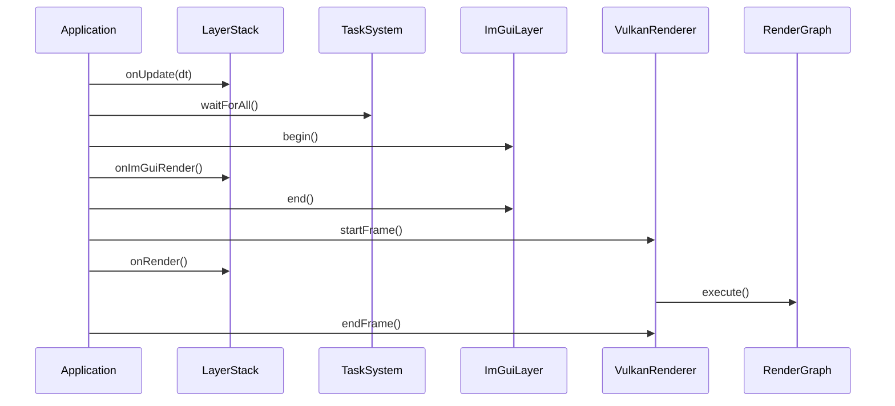
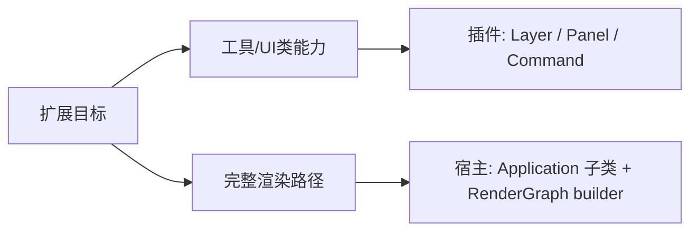

# 第六部分: 最佳实践与进阶

> **提示 (Note):**
> 本文档讨论的是 `F:\Beisent\Luna` 当前已经落地的工程实践。
> 它的目标不是给出一套“未来也许会这样”的理想规范，而是帮助你在现有代码上做出正确扩展，不把架构边界重新写坏。

## 1. 先建立三条工程规则

如果你准备继续扩展 Luna，先记住下面三条规则。

### 1.1 规则一: 宿主负责装配，插件负责能力

当前最重要的架构边界是:

- `App/` 负责应用宿主、生命周期、插件装配
- `Editor/` 负责 editor framework 和扩展协议
- `Plugins/` 负责具体功能实现

这条边界一旦被打破，`LunaApp` 和 `Editor/` 很快就会重新长回单体应用。



### 1.2 规则二: 先选对扩展层级，再写代码

很多设计失控，不是因为实现能力不足，而是因为一开始就把功能放到了错误层级。

| 目标 | 当前推荐扩展层级 | 原因 |
| --- | --- | --- |
| 新增一个编辑器窗口 | `EditorPanel` 插件 | 当前最稳定的 editor 扩展点 |
| 新增一个编辑器动作 | `EditorRegistry::addCommand()` | 菜单触发链路已经稳定 |
| 新增持续运行的交互逻辑 | `Layer` 插件 | 具备 `onUpdate/onEvent/onRender` 生命周期 |
| 修改主相机或 clear color | 插件内 `Layer` / `Panel` | 可通过 `Application::get().getRenderer()` 完成 |
| 共享项目状态、场景状态 | `ServiceRegistry` | 当前的服务容器已经存在 |
| 替换 RenderGraph | 自定义 `Application` / 宿主 | 当前正式注入点只在 renderer 初始化前 |
| 新增 importer registry / asset registry | 先设计新的 registry，再扩展插件协议 | 目前没有正式资产扩展点 |

### 1.3 规则三: 不要把“源码同仓可访问”误当成“正式扩展点”

当前插件确实可以 include 大量底层头文件，也确实可以直接访问 renderer 状态:

```cpp
auto& renderer = luna::Application::get().getRenderer();
renderer.getClearColor().x = 0.2f;
```

但这不等价于:

- 插件系统已经正式支持 RenderGraph 贡献
- 插件系统已经正式支持 RenderPass 注入
- 插件系统已经正式支持底层 renderer 初始化改写

> **警告 (Warning):**
> 如果一个能力没有被 `PluginRegistry`、`EditorRegistry` 或宿主初始化协议显式表达出来，就不要把它写成“稳定插件接口”。

## 2. 性能优化指南

### 2.1 当前一帧的真实执行顺序



从这个顺序可以推导出几个非常重要的事实:

- 逻辑更新发生在渲染前
- JobSystem 会在进入渲染前等待任务完成
- ImGui 构建发生在实际 GPU 帧执行之前
- `Layer::onRender()` 不是 RenderGraph 构建点，它只是每帧渲染阶段的业务钩子

### 2.2 高频性能陷阱

| 陷阱 | 典型表现 | 原因 | 当前建议 |
| --- | --- | --- | --- |
| 每帧重建 RenderGraph | CPU 侧帧时间明显上升 | pass、附件、framebuffer、barrier 都会重建 | 只在 resize 或图结构变化时重建 |
| 频繁调用 `device.waitIdle()` | GPU 吞吐骤降、窗口 resize 卡顿外溢 | 会强行打断 GPU 并行 | 除 resize / shutdown 外尽量避免 |
| 每帧重新编译 GLSL | 首帧后仍持续卡顿 | glslang 编译成本高 | 开发期可以容忍，常态路径优先 `.spv` |
| 大资源反复走 staging 上传 | 带宽浪费，帧间抖动 | `StageBuffer` 容量与频率都有限 | 静态资源尽量在加载期上传后常驻 GPU |
| 频繁重建 descriptor 布局 | CPU 侧对象分配多 | `DescriptorCache` 当前还不是真正的强缓存 | 相同 shader/pipeline 结果尽量复用 |
| UI 面板里做重型 IO 或解析 | 编辑器卡顿、输入迟滞 | `onImGuiRender()` 在主线程同步执行 | 后台任务交给 `TaskSystem`，面板只消费结果 |

### 2.3 当前 renderer 的两个已知热点

#### 热点一: descriptor set 约束仍然偏紧

当前图形/计算 shader 路径还带着“单 descriptor set”倾向，这会直接限制复杂材质系统和更通用的资源绑定设计。

这意味着:

- 简单样例、工具型面板没有问题
- 复杂渲染功能扩展前，descriptor 体系仍然是优先重构点

#### 热点二: RenderGraph 更适合“少量重建、多次执行”

`RenderGraphBuilder` 的价值在于集中完成:

- 资源推导
- 依赖解析
- barrier 生成
- Vulkan 原生对象组织

因此正确思路不是“每帧临时拼图”，而是“结构变化时重建，稳定阶段重复执行”。

## 3. 插件开发最佳实践

### 3.1 Panel 负责 UI，Layer 负责持续逻辑

这是当前最值得坚持的职责边界。

| 场景 | 推荐类型 |
| --- | --- |
| 参数调节窗口、调试信息窗口 | `EditorPanel` |
| 相机控制、场景交互、调试输入 | `Layer` |
| 菜单触发的一次性动作 | `Command` |
| 顶层编辑器壳 | `EditorShellLayer` |

一个很好的对照例子就是 `luna.editor.core`:

- `RendererInfoPanel` 只负责显示与编辑 renderer 状态
- `EditorCameraControllerLayer` 负责持续输入与相机移动

### 3.2 Panel 默认构造限制要提前考虑

`EditorRegistry::addPanel<PanelT>()` 这条模板重载要求:

- `PanelT` 继承自 `EditorPanel`
- `PanelT` 可默认构造

如果你的面板需要依赖对象，不要硬把状态塞进单例。  
当前正确方式是改用工厂重载:

```cpp
registry.editor().addPanel(
    "com.example.stats",
    "Stats",
    [] {
        return std::make_unique<StatsPanel>();
    },
    true);
```

### 3.3 对 `Application::get()` 保持克制

当前它很方便，但它也是典型的“快速接线点”。

推荐做法:

- 短路径访问 renderer、task system 可以直接用
- 跨多个插件共享长期状态时，优先考虑 `ServiceRegistry`
- 不要把它演化成任何东西都从全局取的“万能容器”

### 3.4 `ServiceRegistry` 适合放共享上下文，不适合放临时状态

当前 `ServiceRegistry` 更适合这类对象:

- `EditorRegistry`
- 未来的 `ProjectContext`
- 未来的 `SceneContext`
- 未来的 `SelectionService`

不适合这类对象:

- 每帧变化的短生命周期局部变量
- 只属于某一个 Panel 的私有状态
- 需要复杂销毁顺序但尚未建模的底层资源

## 4. 构建与生成流程最佳实践

### 4.1 日常入口优先使用 `build.py`

当前推荐入口不是手工维护 `Plugins/Generated`，而是:

```powershell
python Tools\luna\build.py editor
python Tools\luna\build.py runtime
python Tools\luna\build.py all
```

原因很简单:

- profile 输出隔离
- 不污染源码目录
- `sync.py -> cmake configure -> build` 一条链串完

### 4.2 改动 Bundle 或 manifest 后，必须重新 sync

下面这些改动都要求重新执行 `sync.py` 或 `build.py`:

- 新增插件目录
- 修改 `luna.plugin.toml`
- 修改 `luna.bundle.toml`
- 修改插件依赖
- 修改插件入口函数名或 CMake target 名

因为这些变化不会自动反映到:

- `PluginList.cmake`
- `ResolvedPlugins.cpp`
- `luna.lock`

### 4.3 不要手工维护 generated 文件

这些文件的定位非常明确:

| 文件 | 性质 |
| --- | --- |
| `PluginList.cmake` | 工具输出 |
| `ResolvedPlugins.h/.cpp` | 工具输出 |
| `luna.lock` | 工具输出 |

它们不是源代码，不应该手工编辑。

## 5. Renderer / RenderGraph 方向的正确扩展方式

### 5.1 当前“最稳”的两条路线



如果你的目标是:

- 面板
- 命令
- 调试叠加层
- 相机控制
- clear color / 相机参数调节

那就走插件。

如果你的目标是:

- 自定义 RenderGraph
- 注入新的 RenderPass
- 做出 `Samples/Model` 那样的完整 GPU 工作流

那就走宿主级扩展。

### 5.2 为什么不建议“先硬做出来再说”

因为当前宿主初始化顺序很明确:

1. `Application::initialize()` 初始化窗口和 renderer
2. `LunaApp::onInit()` 才注册插件

这意味着插件注册发生在 renderer 初始化之后。  
所以“用插件正式替换活动 RenderGraph”在当前架构里缺少清晰、稳定、可维护的协议。

## 6. 二次开发建议

### 6.1 如果你要做 Editor 能力增强

当前最合理的拆分方式是:

- 一个插件负责一个明确能力域
- 不要继续把功能塞回 `Editor/`

推荐的下一批插件形态:

- `luna.viewport`
- `luna.asset.browser`
- `luna.scene.editor`
- `luna.inspector`

### 6.2 如果你要做共享上下文

优先把“跨插件共享的状态”设计成 service，而不是让插件彼此直接 include 和调用。

这会让后面继续扩展:

- 生命周期
- 可测试性
- 初始化顺序
- 插件间耦合控制

都更容易。

### 6.3 如果你要演进渲染插件能力

不要直接把 RenderGraph 细节塞进 `PluginRegistry`。  
更合理的顺序是:

1. 明确宿主允许哪些渲染扩展点
2. 设计独立的 render registry 或 render contribution 协议
3. 再决定插件注册期如何声明这些贡献

## 7. 维护者优先事项

如果按“投入产出比”排序，当前最值得优先做的是:

1. 扩大 editor registry 的扩展面，例如 menu item / toolbar / inspector provider。
2. 让 `ServiceRegistry` 真正承载项目上下文、场景上下文这类共享对象。
3. 解决 descriptor / pipeline / render graph 相关的基础设施热点。
4. 在此基础上再讨论正式的渲染插件协议。

## 8. 一句话总结

Luna 当前最正确的扩展姿势是:

> 用插件扩展工具和业务，用宿主扩展渲染主路径，用 registry 维持边界，用 `build.py + sync.py` 保持装配流程可预测。
