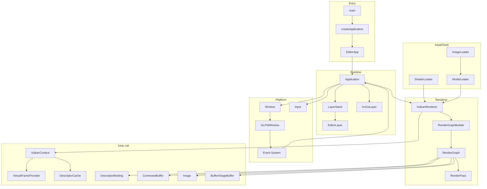
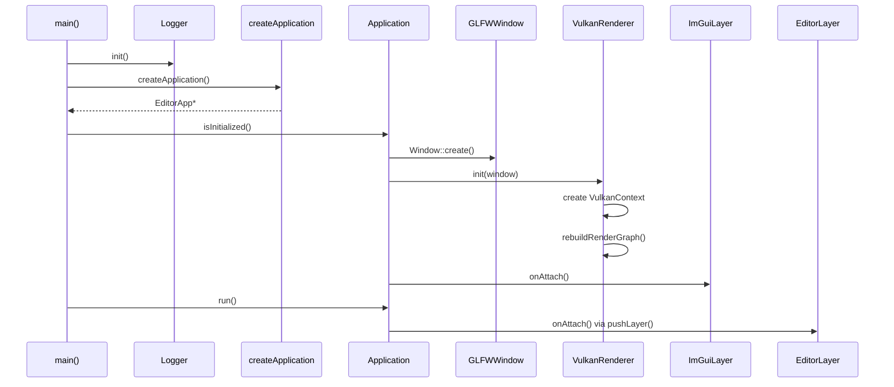
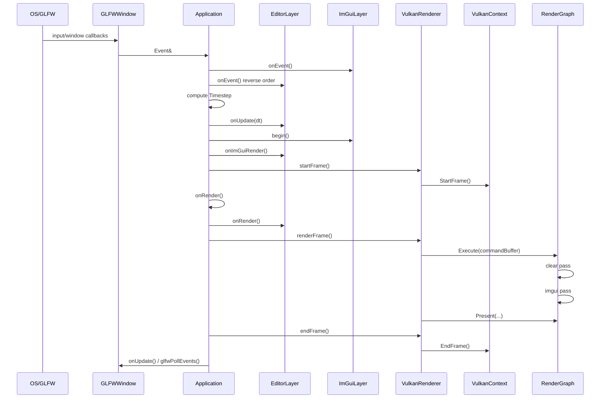
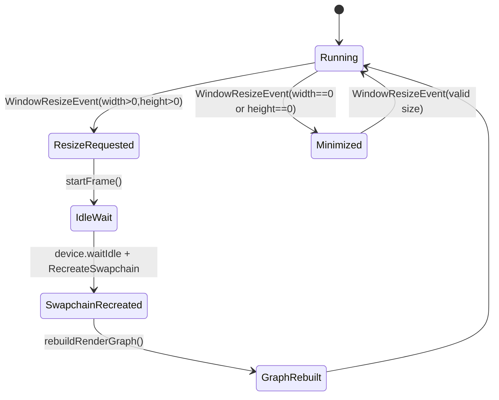

# 第二部分: 架构设计深度剖析

## 系统总览

Luna 的高层结构可以分成五层:

1. 可执行入口层
2. 应用与层系统
3. 平台与事件输入
4. 渲染抽象层
5. Vulkan 资源与命令层



### 宏观职责分工

| 层级 | 核心对象 | 职责 |
| --- | --- | --- |
| 入口层 | `main`, `createApplication` | 组装应用实例 |
| 应用层 | `Application`, `LayerStack`, `Layer` | 生命周期、业务更新、事件分发 |
| 平台层 | `Window`, `GLFWWindow`, `Input` | 窗口消息、原始输入采集 |
| 渲染层 | `VulkanRenderer`, `RenderGraphBuilder`, `RenderGraph` | 帧调度、pass 组织、present |
| 资源/Vulkan 层 | `VulkanContext`, `Buffer`, `Image`, `CommandBuffer` | 真正落地到 Vulkan API |
| 工具层 | `ShaderLoader`, `ModelLoader`, `ImageLoader` | 把磁盘/源码资源转为运行时数据 |

## 目录结构解析

下面的目录树只展示“项目自身的核心源码”，不展开 `third_party/`:

```text
Luna/
├─ Core/                      # 应用框架、主循环、层系统、日志、窗口抽象、输入抽象
│  ├─ Main.cpp                # 真正的程序入口
│  ├─ Application.*           # Application 宿主
│  ├─ Layer.*                 # 逻辑层接口
│  ├─ LayerStack.*            # 层栈容器
│  ├─ Window.*                # 窗口抽象工厂
│  ├─ Input.h                 # 静态输入查询接口
│  └─ Log.*                   # spdlog 包装
├─ Events/                    # 事件类型系统
│  ├─ Event.h
│  ├─ ApplicationEvent.h
│  ├─ KeyEvent.h
│  └─ MouseEvent.h
├─ Platform/                  # 平台实现
│  ├─ GLFWWindow.*            # GLFW 窗口与回调桥接
│  ├─ GLFWWindowInput.cpp     # Input 的 GLFW 后端
│  ├─ GLFWKeyCodes.hpp
│  └─ GLFWMouseCodes.hpp
├─ Imgui/                     # ImGui 与 Vulkan/GLFW 的集成
│  ├─ ImGuiLayer.*            # 引擎侧 ImGui 层
│  ├─ ImGuiContext.*          # ImGui_Impl_* 封装
│  └─ ImGuiRenderPass.h       # RenderGraph 中的 ImGui pass
├─ Renderer/                  # 更高层的渲染组织与资源导入器
│  ├─ VulkanRenderer.*        # 引擎渲染入口
│  ├─ RenderGraph.*           # 执行图
│  ├─ RenderGraphBuilder.*    # 图构建器与自动同步
│  ├─ ShaderLoader.*          # GLSL/SPIR-V 编译与反射
│  ├─ ModelLoader.*           # OBJ/glTF 模型导入
│  ├─ ImageLoader.*           # 图片导入
│  └─ Camera.*                # 简单自由摄像机数据结构
└─ Vulkan/                    # Vulkan 抽象层
   ├─ VulkanContext.*         # 实例、设备、交换链、帧资源中心
   ├─ VirtualFrame.*          # 多帧并行基础设施
   ├─ CommandBuffer.*         # 命令记录包装
   ├─ Buffer.*                # Vulkan buffer + VMA
   ├─ Image.*                 # Vulkan image + view
   ├─ StageBuffer.*           # CPU->GPU 上传暂存
   ├─ Pipeline.*              # pass 声明结果
   ├─ RenderPass.*            # pass 抽象接口
   ├─ DescriptorBinding.*     # descriptor 绑定与解析
   ├─ DescriptorCache.*       # descriptor pool/layout/set 管理
   ├─ GraphicShader.*         # 图形着色器模块封装
   ├─ ComputeShader.*         # 计算着色器模块封装
   ├─ Sampler.*               # 采样器封装
   ├─ ShaderReflection.*      # SPIR-V 反射类型系统
   ├─ VulkanMemoryAllocator.* # VMA 封装
   └─ VulkanSurface.*         # GLFW Surface 创建

Editor/
├─ EditorApp.*                # 编辑器应用入口
└─ EditorLayer.h              # 默认编辑器层，控制摄像机和调试面板

Shaders/
└─ Internal/                  # 内置着色器源码与编译产物

assets/                       # 当前示例资源
```

### 目录责任边界

| 目录 | 允许知道什么 | 不应该承担什么 |
| --- | --- | --- |
| `Core/` | 主循环、层系统、窗口抽象 | 具体 Vulkan 资源管理 |
| `Platform/` | GLFW 细节、平台输入查询 | 业务逻辑与渲染图搭建 |
| `Renderer/` | 帧组织、资源导入、渲染调度 | 平台事件源管理 |
| `Vulkan/` | Vulkan API 封装和同步细节 | 应用业务行为 |
| `Editor/` | 编辑器 UI 与交互 | 直接创建 Vulkan 上下文 |

## 核心数据流与生命周期

### 启动生命周期



### 每帧执行路径



### 窗口尺寸变化与交换链重建



## 设计模式与解耦策略

### 1. 工厂模式

| 位置 | 模式 | 作用 |
| --- | --- | --- |
| `createApplication()` | 抽象工厂 | 隐藏具体应用类型 |
| `Window::create()` | 简单工厂 | 隐藏平台窗口实现 |

### 2. 模板方法模式

`Application::run()` 定义了主循环骨架，而子类通过覆写以下钩子插入行为:

- `onInit()`
- `onUpdate(Timestep)`
- `onRender()`
- `onShutdown()`

### 3. 观察者/事件分发

GLFW 回调不会直接操作业务对象，而是转换成 `Event` 子类，再通过 `Application::onEvent()` 分发给:

1. `ImGuiLayer`
2. LayerStack 中的各层，逆序遍历

### 4. 组合模式

`LayerStack` 本质上是对多个 `Layer` 的组合式管理。对外部来说，应用更新阶段并不关心具体层的种类，只关心统一的生命周期函数。

### 5. 构建器模式

`RenderGraphBuilder` 是整个渲染架构里最重要的构建器模式实例。它负责:

- 收集 RenderPass 声明
- 收集附件与资源依赖
- 计算跨 pass 的资源使用转换
- 自动生成 pipeline barrier 回调
- 构造最终 `RenderGraph`

### 6. 资源解析表模式

`DescriptorBinding` + `ResolveInfo` 的组合，本质上是一种“命名资源表 + 迟绑定”策略:

- `Pipeline` 声明“我要绑定名为 `albedo` 的图片”
- 真正的 `Image` 对象到帧执行前才通过 `ResolveInfo` 注入

### 7. 单例/全局上下文

当前代码里存在两个显式全局点:

| 全局点 | 说明 | 风险 |
| --- | --- | --- |
| `Application::m_s_instance` | 单例式应用访问入口 | 方便但提高全局耦合 |
| `GetCurrentVulkanContext()` | 当前 Vulkan 上下文 | 简化 API，但不利于多上下文并行 |

> **警告 (Warning):**
> 这两个全局入口非常适合当前单应用、单窗口、单渲染上下文模型；如果未来要支持多窗口或多渲染后端，这会成为重构热点。

## 一句话架构总结

Luna 的架构本质上是:

> 以 `Application` 驱动生命周期，以 `LayerStack` 解耦业务逻辑，以 `RenderGraph` 组织 GPU 工作流，以 `VulkanContext` 兜底所有原生资源和同步细节。
