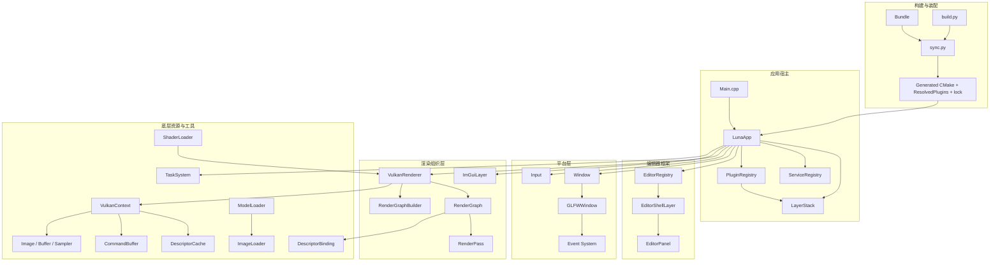
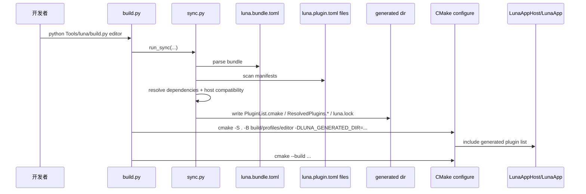
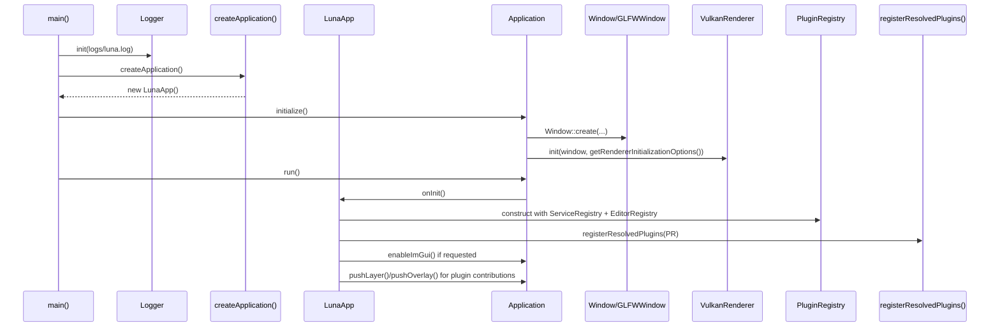
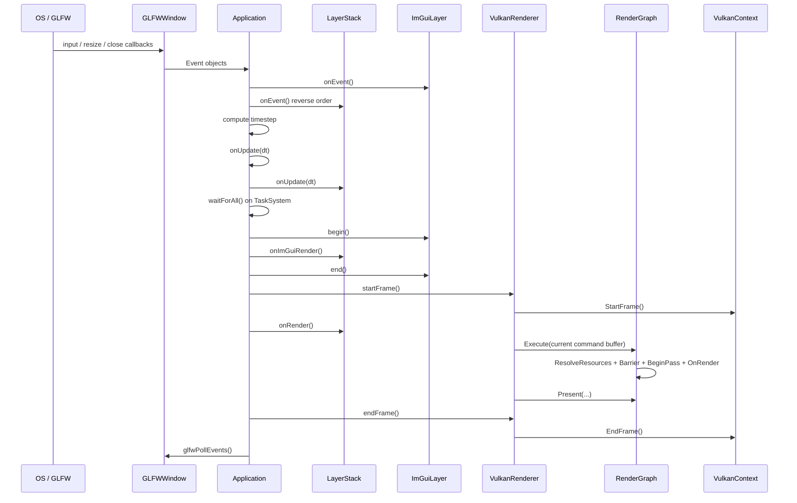

# 第二部分: 架构设计深度剖析

## 系统总览

Luna 当前的系统可以拆成六层:

1. 构建与装配层
2. 应用宿主层
3. 插件注册与 editor framework 层
4. 平台与输入层
5. 渲染组织层
6. Vulkan 资源与工具层



### 宏观职责分工

| 层级 | 关键对象 | 职责 |
| --- | --- | --- |
| 构建与装配 | `sync.py`, `build.py`, `PluginList.cmake` | 解析 Bundle、生成插件构建输入、隔离 profile 输出 |
| 宿主层 | `LunaApp`, `Application`, `LayerStack` | 管理窗口、事件、主循环、插件装配 |
| 插件/编辑器层 | `PluginRegistry`, `ServiceRegistry`, `EditorRegistry` | 声明 Layer、Panel、Command 等贡献 |
| 平台层 | `Window`, `GLFWWindow`, `Input` | 窗口生命周期、GLFW 回调、输入桥接 |
| 渲染组织层 | `VulkanRenderer`, `RenderGraph`, `RenderPass` | 每帧录制、RenderGraph 执行、ImGui 集成 |
| 底层资源层 | `VulkanContext`, `CommandBuffer`, `Image`, `Buffer` | Vulkan API、同步、资源、descriptor 与上传 |

## 目录结构解析

下面这棵树只保留当前项目最重要的目录与文件:

```text
Luna/
├─ App/
│  ├─ CMakeLists.txt                 # 宿主 target，读取生成出来的插件清单
│  ├─ LunaApp.h
│  └─ LunaApp.cpp                    # 当前唯一正式宿主
├─ Bundles/
│  ├─ EditorDefault/luna.bundle.toml
│  └─ RuntimeDefault/luna.bundle.toml
├─ Docs/
│  ├─ manual/
│  ├─ plugins/
│  ├─ reference/
│  └─ advanced/
├─ Editor/
│  ├─ CMakeLists.txt
│  ├─ EditorPanel.h
│  ├─ EditorRegistry.h/.cpp
│  └─ EditorShellLayer.h/.cpp        # Editor shell 承载层
├─ Luna/
│  ├─ Core/
│  │  ├─ Main.cpp                    # 真正的可执行入口
│  │  ├─ Application.h/.cpp
│  │  ├─ Layer.h
│  │  ├─ LayerStack.h/.cpp
│  │  ├─ Window.h/.cpp
│  │  ├─ Input.h
│  │  └─ Log.h/.cpp
│  ├─ Events/
│  ├─ Imgui/
│  ├─ JobSystem/
│  ├─ Platform/
│  ├─ Plugin/
│  │  ├─ PluginBootstrap.h
│  │  ├─ PluginRegistry.h/.cpp
│  │  └─ ServiceRegistry.h
│  ├─ Renderer/
│  │  ├─ Camera.h/.cpp
│  │  ├─ VulkanRenderer.h/.cpp
│  │  ├─ RenderGraph.h/.cpp
│  │  ├─ RenderGraphBuilder.h/.cpp
│  │  ├─ ShaderLoader.h/.cpp
│  │  ├─ ModelLoader.h/.cpp
│  │  └─ ImageLoader.h/.cpp
│  ├─ Scene/
│  │  ├─ Components.h
│  │  ├─ Entity.h/.cpp
│  │  └─ Scene.h/.cpp                # 最小 runtime scene / entity / component 抽象
│  └─ Vulkan/
│     ├─ VulkanContext.h/.cpp
│     ├─ VirtualFrame.h/.cpp
│     ├─ RenderPass.h/.cpp
│     ├─ Pipeline.h/.cpp
│     ├─ DescriptorBinding.h/.cpp
│     ├─ DescriptorCache.h/.cpp
│     ├─ CommandBuffer.h/.cpp
│     ├─ Buffer.h/.cpp
│     ├─ Image.h/.cpp
│     ├─ Sampler.h/.cpp
│     └─ GraphicShader.h/.cpp
├─ Plugins/
│  ├─ builtin/
│  │  ├─ luna.imgui/
│  │  ├─ luna.editor.shell/
│  │  ├─ luna.editor.core/
│  │  ├─ luna.example.hello/
│  │  ├─ luna.example.imgui_demo/
│  │  └─ luna.runtime.core/
│  ├─ external/
│  └─ Generated/                     # 默认 raw sync 输出目录
├─ Samples/
│  └─ Model/                         # 自定义宿主 + RenderGraph 样例
├─ Tools/
│  └─ luna/
│     ├─ sync.py
│     └─ build.py
├─ build/
│  └─ profiles/
│     ├─ editor/
│     └─ runtime/
└─ third_party/
```

### 目录边界

| 目录 | 应该做什么 | 不应该做什么 |
| --- | --- | --- |
| `App/` | 组装宿主、链接生成文件、承载应用启动骨架 | 承载具体 editor 工具逻辑 |
| `Editor/` | 定义 editor framework 扩展协议 | 继续塞大量具体面板和工作流 |
| `Plugins/` | 具体功能插件与扩展实现 | 反向接管宿主生命周期 |
| `Renderer/` | 更高层的渲染组织和导入器 | 处理平台事件源 |
| `Scene/` | 维护 runtime scene、entity/component 与 scene submission | 直接持有窗口、交换链或平台事件源 |
| `Vulkan/` | Vulkan 资源、命令、同步封装 | 决定业务级工具行为 |
| `Tools/` | 解析配置、生成中间文件、驱动构建 | 参与运行时逻辑 |

## 构建期数据流

当前插件系统的构建期链路已经是主架构的一部分，不应该被当成“额外脚本”忽略。



### 这一层为什么重要

因为当前插件不是动态发现的。  
它们是:

1. 先被构建工具解析
2. 再显式生成到 `ResolvedPlugins.cpp`
3. 再被宿主在启动时显式注册

这解释了为什么 Luna 当前强调:

- 构建图透明
- 注册顺序显式
- 不依赖静态初始化魔法

## 启动生命周期

### 从 `main()` 到 `LunaApp::onInit()`



### 关键观察

| 观察 | 含义 |
| --- | --- |
| `Renderer` 先于插件注册完成初始化 | 当前插件无法在正式 API 层面替换 renderer 初始化参数 |
| `EditorRegistry` 在宿主构造时就创建 | editor plugins 不需要自己创建 editor framework |
| 插件贡献的是“声明”，宿主控制的是“实例化与生命周期” | 这是当前架构最重要的边界之一 |

## 每帧生命周期



### 一帧里真正发生了什么

1. `Application` 先计算 `Timestep`。
2. 所有 `Layer` 先做逻辑更新。
3. JobSystem 在进入渲染前 `waitForAll()`。
4. 如果启用了 ImGui，先完成本帧 UI 构建。
5. `VulkanRenderer` 开始帧，执行 RenderGraph，最后 present。

这意味着 `Layer::onRender()` 当前更像“渲染阶段业务钩子”，不是“直接拿到命令缓冲去录制整张图”的接口。

## 窗口尺寸变化与交换链重建

```mermaid
stateDiagram-v2
    [*] --> Running
    Running --> ResizeRequested: WindowResizeEvent(valid size)
    Running --> Minimized: width == 0 or height == 0
    Minimized --> Running: valid resize event
    ResizeRequested --> WaitingIdle: next startFrame()
    WaitingIdle --> RecreateSwapchain: device.waitIdle()
    RecreateSwapchain --> RebuildGraph: VulkanRenderer::rebuildRenderGraph()
    RebuildGraph --> Running
```

这里的关键设计点是:

- 宿主不在事件回调里直接重建 swapchain
- 而是在下一帧 `startFrame()` 时统一处理 pending resize

这样能避免在 GLFW 回调里打断当前帧资源状态。

## 设计模式与解耦策略

### 1. 模板方法模式

`Application` 把主循环骨架固定下来，并通过以下钩子允许宿主插入行为:

- `getRendererInitializationOptions()`
- `onInit()`
- `onUpdate(Timestep)`
- `onShutdown()`

这解释了为什么 `Samples/Model` 可以通过自定义 `Application` 在 renderer 初始化前插入 RenderGraph builder。

### 2. 构建器模式

`RenderGraphBuilder` 是渲染系统里最核心的构建器模式实例。它负责:

- 收集 pass
- 推导依赖
- 分配附件
- 生成 barrier 回调
- 产出最终 `RenderGraph`

### 3. 注册表模式

当前有三类关键注册表:

| 注册表 | 作用 |
| --- | --- |
| `ServiceRegistry` | 共享服务容器 |
| `PluginRegistry` | 插件注册期贡献入口 |
| `EditorRegistry` | editor shell 扩展点容器 |

注册表让宿主与插件的关系保持在“声明贡献”层，而不是彼此直接硬编码调用。

### 4. 显式装配优先

Luna 当前刻意不使用:

- 静态构造自动注册
- 运行时 DLL 扫描

而是选择:

- `ResolvedPlugins.cpp` 显式列出插件入口
- 宿主统一调用 `registerResolvedPlugins()`

这让调试和构建图都更透明。

### 5. 全局访问点最小化但仍然存在

当前代码里有两个典型全局入口:

| 入口 | 当前用途 | 风险 |
| --- | --- | --- |
| `Application::get()` | 让 Layer / Panel 获取 renderer、task system | 方便但会提高全局耦合 |
| `GetCurrentVulkanContext()` | 让 shader / buffer / image 等底层类型访问当前 Vulkan 上下文 | 当前单上下文模型很方便，但未来多上下文时会成为重构热点 |

## 当前最重要的架构边界

### 1. 插件系统是“源码插件系统”，不是“动态插件系统”

所以最重要的问题不是“如何加载 DLL”，而是:

- 如何声明贡献
- 如何生成构建图
- 如何把宿主与插件边界做稳

### 2. Editor framework 与 editor plugins 已经分层

这点非常重要:

- `Editor/` 负责 editor framework
- `Plugins/builtin/luna.editor.*` 负责 editor 功能

这为后续继续增加 Menu / Toolbar / Inspector / Asset Browser 类扩展点打下了结构基础。

### 3. RenderGraph 仍然是宿主级扩展点

这是当前最值得明确写进文档的事实:

- Renderer 很强
- `Samples/Model` 很完整
- 但 `LunaApp` 的插件系统还没有正式的 `RenderFeatureRegistry` 或 `RenderGraphContribution`
- 默认 `LunaApp` 当前使用 `SceneRenderer` 构建默认场景图
- 插件可以在初始化后通过 `getSceneRenderer().setShaderPaths(...)` 和 `requestRenderGraphRebuild()` 影响这条默认路径
- 但插件仍然不能提供新的 `RenderGraphBuilderCallback`，也不能正式注入任意 `RenderPass`

因此如果你要做“像 `Samples/Model` 那样的完整渲染效果”，当前最正确的方式仍然是:

- 写自定义宿主 / 自定义 app
- 或继续演进宿主级渲染扩展协议

## 一句话架构总结

Luna 当前的架构本质是:

> 用 `Application` 固定生命周期，用 `Bundle + sync.py + build.py` 固定插件装配流程，用 `PluginRegistry / EditorRegistry` 固定扩展边界，再由 `VulkanRenderer + RenderGraph` 负责每帧 GPU 工作流。
