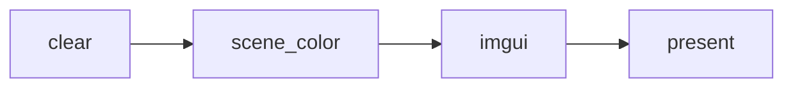

# 第六部分: 使用现有框架与 RenderGraph 构建应用

这篇文档回答两个实际问题:

1. 如何沿用 Luna 现有的 `Application` / `Layer` / `VulkanRenderer` 框架搭一个自己的应用。
2. 如何把自定义 `RenderGraph` 接进这个应用，而不是停留在默认的 `clear -> imgui -> present`。

> **提示 (Note):**
> 下面的说明全部基于仓库当前实现: `Luna/Core/Main.cpp`、`Luna/Core/Application.*`、`Luna/Renderer/VulkanRenderer.*`，以及 `samples/Triangle/*`。

## 一条最重要的主线

如果只记一条调用链，应该记下面这条:

```text
main()
  -> createApplication()
  -> Application::initialize()
      -> Window::create()
      -> VulkanRenderer::init(...)
      -> ImGuiLayer::onAttach()
  -> Application::run()
      -> onInit()
      -> Layer::onUpdate()
      -> Layer::onImGuiRender()
      -> Layer::onRender()
      -> VulkanRenderer::renderFrame()
```

这条调用链意味着:

- 你通常不需要修改 `main()`。
- 你真正需要实现的是一个 `Application` 子类。
- CPU 侧业务逻辑优先放在 `Layer`。
- GPU 工作流优先放在 `RenderPass` + `RenderGraph`。

## 先分清 4 个角色

### 1. `Application`: 应用装配器

它负责把窗口、渲染器、ImGui、层系统组装到一起，并定义应用级生命周期:

- `getRendererInitializationOptions()` 决定渲染器如何初始化
- `onInit()` 挂载业务层
- `onUpdate()` 写应用级更新
- `onShutdown()` 做收尾

### 2. `Layer`: 业务层

它负责 CPU 侧逻辑和 UI:

- `onUpdate()` 写输入、状态推进、相机控制
- `onEvent()` 处理事件
- `onImGuiRender()` 画调试面板和工具面板
- `onRender()` 处理每帧渲染前的业务同步

`onRender()` 不是直接替代 `RenderPass::OnRender()`。前者仍然属于应用层回调，后者才是真正记录 GPU 命令的地方。

### 3. `VulkanRenderer`: 帧驱动器

它负责:

- 初始化 `VulkanContext`
- 根据窗口尺寸构建或重建 `RenderGraph`
- 驱动 `startFrame() -> renderFrame() -> endFrame()`

如果你没有提供自定义回调，它会自动构建默认图:



### 4. `RenderPass` / `RenderGraph`: GPU 工作流

- `RenderPass` 负责声明单个 GPU 阶段
- `RenderGraphBuilder` 负责把多个 pass 组织成图
- `RenderGraph` 负责执行、同步和最终呈现

判断标准很简单:

- “我要响应输入、改状态、画 UI” -> 写 `Layer`
- “我要声明附件、绑定 shader、录制 draw/dispatch” -> 写 `RenderPass`

## 路径 A: 只使用现有框架，保持默认 RenderGraph

如果你的目标只是做一个工具壳、编辑器壳，或者先接业务层 UI，那么不需要马上改渲染图。

仓库里的 `EditorApp` 就是这种模式:

```cpp
class EditorApp final : public luna::Application {
public:
    EditorApp()
        : Application(luna::ApplicationSpecification{
              .m_name = "Luna Editor",
              .m_window_width = 1700,
              .m_window_height = 900,
          }) {}

protected:
    void onInit() override {
        pushLayer(std::make_unique<EditorLayer>());
    }
};

namespace luna {
Application* createApplication(int, char**) {
    return new editor::EditorApp();
}
}
```

这时你获得的能力是:

- 窗口和事件系统已经可用
- `ImGuiLayer` 已经自动初始化
- 渲染器会用默认 `clear + imgui` 图
- 你的 `Layer` 可以直接开始写工具逻辑

适合场景:

- 做编辑器面板
- 验证输入系统
- 做非复杂渲染的调试工具
- 在真正接场景渲染前先把应用框架搭起来

## 路径 B: 使用自定义 RenderGraph 构建应用

如果你想真正控制 GPU 输出，关键入口不是改 `Application::run()`，而是覆写:

```cpp
VulkanRenderer::InitializationOptions getRendererInitializationOptions() override;
```

仓库里的 `samples/Triangle` 就是标准示范。

### 第 1 步: 定义应用类

```cpp
class TriangleApp final : public luna::Application {
public:
    TriangleApp()
        : Application(luna::ApplicationSpecification{
              .m_name = "Luna Triangle Sample",
              .m_window_width = 1280,
              .m_window_height = 720,
          }) {}

protected:
    luna::VulkanRenderer::InitializationOptions getRendererInitializationOptions() override {
        return {
            .m_render_graph_builder = buildTriangleRenderGraph
        };
    }

    void onInit() override {
        pushLayer(std::make_unique<TriangleLayer>());
    }
};
```

这里的核心不是 `onInit()`，而是把 `buildTriangleRenderGraph` 作为回调交给渲染器。

### 第 2 步: 实现 RenderGraph 构建函数

回调签名是:

```cpp
std::unique_ptr<luna::val::RenderGraph>
buildMyRenderGraph(const luna::VulkanRenderer::RenderGraphBuildInfo& build_info);
```

`build_info` 提供当前图构建时最关键的 3 个输入:

| 字段 | 作用 |
| --- | --- |
| `m_surface_format` | 当前表面格式，通常也是最终颜色附件格式 |
| `m_framebuffer_width` | 当前帧缓冲宽度 |
| `m_framebuffer_height` | 当前帧缓冲高度 |

一个最小示例:

```cpp
std::unique_ptr<luna::val::RenderGraph>
buildMyRenderGraph(const luna::VulkanRenderer::RenderGraphBuildInfo& build_info)
{
    luna::val::RenderGraphBuilder builder;
    builder
        .AddRenderPass("scene", std::make_unique<MyScenePass>(build_info))
        .AddRenderPass("imgui", std::make_unique<luna::val::ImGuiRenderPass>("scene_color"))
        .SetOutputName("scene_color");

    return builder.Build();
}
```

这里要注意两件事:

- `ImGuiRenderPass("scene_color")` 表示 ImGui 叠加到名为 `scene_color` 的附件上
- `SetOutputName("scene_color")` 表示最终要 present 的附件就是它

## 第 3 步: 写自己的 `RenderPass`

一个 pass 至少要回答两个问题:

1. 我要读写哪些资源。
2. 我要在命令缓冲里录什么命令。

因此最常用的是这两个函数:

- `SetupPipeline(PipelineState pipeline)`
- `OnRender(RenderPassState state)`

### `SetupPipeline()`: 声明资源和管线

这一步做“声明”，不是做真正绘制:

```cpp
class MyScenePass final : public luna::val::RenderPass {
public:
    explicit MyScenePass(const luna::VulkanRenderer::RenderGraphBuildInfo& build_info)
        : m_surface_format(build_info.m_surface_format),
          m_width(build_info.m_framebuffer_width),
          m_height(build_info.m_framebuffer_height) {}

    void SetupPipeline(luna::val::PipelineState pipeline) override {
        pipeline.Shader = m_shader;
        pipeline.DeclareAttachment("scene_color", m_surface_format, m_width, m_height);
        pipeline.AddOutputAttachment("scene_color", luna::val::ClearColor{0.08f, 0.10f, 0.14f, 1.0f});
    }

    void OnRender(luna::val::RenderPassState state) override {
        const auto& scene_color = state.GetAttachment("scene_color");
        state.Commands.SetRenderArea(scene_color);
        state.Commands.Draw(3, 1);
    }

private:
    luna::val::Format m_surface_format{luna::val::Format::UNDEFINED};
    uint32_t m_width{0};
    uint32_t m_height{0};
    std::shared_ptr<luna::val::GraphicShader> m_shader;
};
```

### `OnRender()`: 录制 GPU 命令

在这一步你已经拿到了:

- `state.Commands`: 当前命令缓冲封装
- `state.Pass`: 当前 pass 的原生管线/布局信息
- `state.GetAttachment(name)`: 已解析出的运行时附件

`samples/Triangle/TriangleRenderPass.cpp` 的实际做法就是:

1. 在构造函数里创建并上传顶点数据
2. 在 `SetupPipeline()` 里绑定 shader、声明 `scene_color`
3. 在 `OnRender()` 里设置 render area、绑定顶点缓冲、推送常量、调用 `Draw(3, 1)`

这也是当前仓库里最值得模仿的“自定义图形 pass”。

## RenderGraph 什么时候会重建

文档里最容易漏掉的一点是: 你的图不是只在启动时构建一次。

当前实现下，`VulkanRenderer::rebuildRenderGraph()` 会在两种场景触发:

1. `VulkanRenderer::init()` 完成 Vulkan 初始化后
2. 窗口 resize 事件触发 `Application::onWindowResize()`，随后渲染器在下一帧重建交换链和渲染图

这意味着:

- 不要把宽高写死在 pass 外面
- 优先通过 `RenderGraphBuildInfo` 读取当前尺寸
- 与 framebuffer 尺寸绑定的附件、视口、投影参数，应该围绕图重建流程更新

## 推荐的工程组织方式

如果你要新做一个应用，建议按下面这条边界来拆:

### `App` 层

负责:

- 配置 `ApplicationSpecification`
- 决定挂哪些 `Layer`
- 决定是否提供自定义 `RenderGraphBuilderCallback`

不负责:

- 直接写 Vulkan 命令
- 在这里堆复杂 UI 逻辑

### `Layer` 层

负责:

- 输入
- 相机控制
- 调试数据
- ImGui 面板
- 业务状态更新

不负责:

- 直接声明 RenderGraph 附件
- 手动管理图像 layout

### `RenderPass` 层

负责:

- shader、顶点输入、descriptor、push constants
- 绘制或 dispatch
- 基于命名附件组织资源依赖

不负责:

- 事件分发
- 应用生命周期管理

## 一个可复用的搭建模板

下面这份模板对应当前仓库推荐做法:

```cpp
class MyLayer final : public luna::Layer {
public:
    MyLayer() : Layer("MyLayer") {}

    void onUpdate(luna::Timestep dt) override {
        // 输入、业务状态、相机参数
    }

    void onImGuiRender() override {
        // 调试面板
    }
};

class MyApp final : public luna::Application {
public:
    MyApp()
        : Application(luna::ApplicationSpecification{
              .m_name = "My Luna App",
              .m_window_width = 1600,
              .m_window_height = 900,
          }) {}

protected:
    luna::VulkanRenderer::InitializationOptions getRendererInitializationOptions() override {
        return {
            .m_render_graph_builder = buildMyRenderGraph
        };
    }

    void onInit() override {
        pushLayer(std::make_unique<MyLayer>());
    }
};

namespace luna {
Application* createApplication(int, char**) {
    return new MyApp();
}
}
```

如果你暂时不需要自定义图，把 `getRendererInitializationOptions()` 删掉即可，此时会自动退回默认 RenderGraph。

## 常见误区

| 误区 | 实际情况 |
| --- | --- |
| 需要修改 `main()` 才能做新应用 | 不需要，通常只要实现新的 `createApplication()` |
| `Layer::onRender()` 就是写 GPU pass 的地方 | 不对，它只是应用层每帧渲染阶段钩子 |
| RenderGraph 只会在启动时构建一次 | 不对，resize 后会重建 |
| 自定义图就必须自己处理 present | 不需要，`RenderGraph::Present()` 仍由 `VulkanRenderer::renderFrame()` 统一调用 |
| ImGui 必须脱离 RenderGraph 单独渲染 | 当前实现里它本身就是一个 `ImGuiRenderPass` |

## 推荐阅读顺序

如果你准备真正落一个新应用，推荐按下面顺序结合源码阅读:

1. `Luna/Core/Main.cpp`
2. `Luna/Core/Application.h` 和 `Luna/Core/Application.cpp`
3. `Luna/Renderer/VulkanRenderer.h` 和 `Luna/Renderer/VulkanRenderer.cpp`
4. `Editor/EditorApp.cpp`
5. `samples/Triangle/TriangleApp.cpp`
6. `samples/Triangle/TriangleRenderPass.cpp`

读完这 6 处，你基本就能判断“新需求应该落在 App、Layer 还是 RenderPass”。
