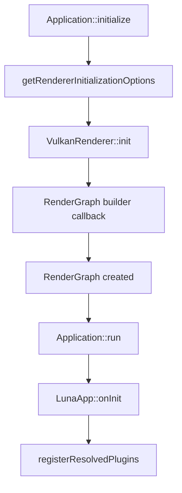
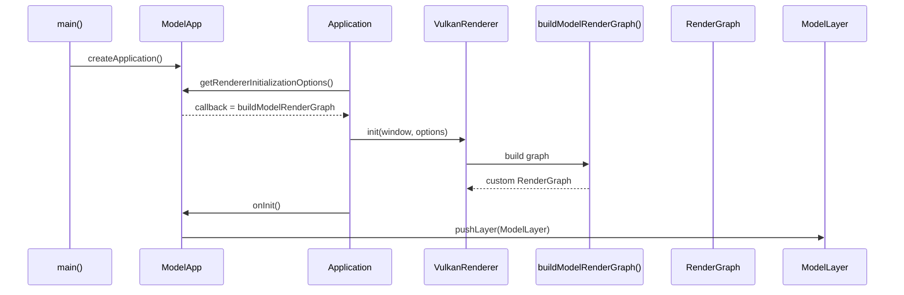

# 第四部分: 使用现有框架与 RenderGraph 构建应用

## 这篇文档解决什么问题

这篇文档专门回答下面这个问题:

> 如果我想做一个类似 `Samples/Model` 的效果，应该通过什么层级接入 RenderGraph？

当前正确答案是:

- 如果你要**替换或自定义活动宿主的 RenderGraph**，应当从**宿主应用层**接入。
- 当前插件系统还**没有**正式的 `RenderGraphContribution` 或 `RenderFeatureRegistry`。

这不是因为插件不能访问 renderer，而是因为**renderer 初始化参数的正式注入点发生在插件注册之前**。
这也不等于插件完全不能影响默认场景渲染链路:
当前公共 API 已允许插件在初始化后通过 `SceneRenderer` 调整默认 scene shader 路径并请求图重建，但它仍然不能提供新的 builder callback。

## 先明确当前边界



从这个时序你能看到:

- Renderer 在 `Application::initialize()` 阶段就初始化完成
- 插件是在 `LunaApp::onInit()` 阶段才注册

所以当前插件系统正式支持的是:

- Layer / Overlay
- Editor Panel / Command
- ImGui request

而当前**不正式支持**的是:

- 在插件注册阶段替换 renderer 初始化参数
- 为活动宿主注入新的 RenderGraph builder

> **警告 (Warning):**
> 这篇文档讨论的是“当前代码中正式支持的方式”。  
> 不是“源码同仓的插件理论上能不能硬写某些 renderer 代码”。

## `Samples/Model` 是如何工作的

`Samples/Model` 提供了当前最完整的“自定义宿主 + 自定义渲染图”示范。

它的关键链路如下:



当前样例分成三层职责:

| 文件 | 角色 |
| --- | --- |
| `Samples/Model/ModelApp.*` | 自定义宿主，负责在初始化前注入 RenderGraph builder |
| `Samples/Model/ModelRenderPass.*` | 定义自定义 RenderPass 与资源上传逻辑 |
| `Samples/Model/ModelLayer.h` | 负责相机交互与 UI |

## 最小自定义宿主示例

### 1. 自定义 `Application`

```cpp
#include "Core/Application.h"
#include "Renderer/VulkanRenderer.h"

std::unique_ptr<luna::val::RenderGraph>
buildMyRenderGraph(const luna::VulkanRenderer::RenderGraphBuildInfo& build_info);

class MyRenderGraphApp final : public luna::Application {
public:
    MyRenderGraphApp()
        : Application(luna::ApplicationSpecification{
              .m_name = "My RenderGraph App",
              .m_window_width = 1440,
              .m_window_height = 900,
              .m_enable_imgui = true,
          })
    {}

protected:
    VulkanRenderer::InitializationOptions getRendererInitializationOptions() override
    {
        return VulkanRenderer::InitializationOptions{
            .m_render_graph_builder = buildMyRenderGraph,
        };
    }

    void onInit() override
    {
        // pushLayer(...);
    }
};
```

### 2. 接管 `createApplication()`

```cpp
namespace luna {

Application* createApplication(int, char**)
{
    return new MyRenderGraphApp();
}

} // namespace luna
```

这就是当前“像 `Samples/Model` 那样接入 RenderGraph”的正式入口。

## 最小自定义 RenderPass 示例

### 1. 声明 pass

```cpp
#include "Vulkan/RenderPass.h"

class MyPass final : public luna::val::RenderPass {
public:
    void SetupPipeline(luna::val::PipelineState pipeline) override
    {
        pipeline.DeclareAttachment("scene_color", luna::val::Format::R8G8B8A8_UNORM, 0, 0);
        pipeline.AddOutputAttachment("scene_color", luna::val::ClearColor{0.04f, 0.05f, 0.08f, 1.0f});
    }

    void OnRender(luna::val::RenderPassState state) override
    {
        const auto& color = state.GetAttachment("scene_color");
        state.Commands.SetRenderArea(color);
        // 这里继续绑定 pipeline / vertex buffer / push constants / DrawIndexed
    }
};
```

### 2. 组装 RenderGraph

```cpp
#include "Imgui/ImGuiRenderPass.h"
#include "Renderer/RenderGraphBuilder.h"

std::unique_ptr<luna::val::RenderGraph>
buildMyRenderGraph(const luna::VulkanRenderer::RenderGraphBuildInfo& build_info)
{
    luna::val::RenderGraphBuilder builder;

    builder
        .AddRenderPass("main", std::make_unique<MyPass>())
        .AddRenderPass("imgui", std::make_unique<luna::val::ImGuiRenderPass>("scene_color"))
        .SetOutputName("scene_color");

    return builder.Build();
}
```

### 3. 这段代码真正做了什么

`RenderGraphBuilder` 会:

1. 调用各个 pass 的 `SetupPipeline()`
2. 根据输出附件和 descriptor 绑定推导资源依赖
3. 自动分配附件图像
4. 构造原生 Vulkan render pass / framebuffer / pipeline
5. 生成 barrier 回调
6. 最终产出一张可执行的 `RenderGraph`

## `Samples/Model` 比这个最小示例多做了什么

`Samples/Model` 在最小示例基础上又增加了这些内容:

- 通过 `ShaderLoader` 编译 GLSL
- 通过 `GraphicShader` 构建图形 pipeline
- 通过 `ModelLoader` 导入 OBJ
- 通过 `ImageLoader` / `Image` / `Sampler` 上传材质纹理
- 通过 `ModelLayer` 驱动相机交互
- 在 `OnRender()` 中完成 descriptor 更新、vertex/index buffer 绑定与 draw call

这说明:

- Luna 的 renderer 和资源系统已经足够承载较完整的样例
- 但这条链路当前仍然是“宿主接入”，不是“插件接入”

## 什么时候应该选择“宿主自定义”，什么时候应该选择“插件”

| 目标 | 推荐方式 |
| --- | --- |
| 新增 editor panel / command / tool UI | 插件 |
| 新增 runtime layer、相机逻辑、输入逻辑 | 插件 |
| 修改 clear color、相机、默认 `SceneRenderer` 配置 | 插件内 Layer / Panel 即可 |
| 替换整个 RenderGraph | 自定义宿主 |
| 注入自定义 RenderPass / 资源上传路径 | 自定义宿主 |
| 做类似 `Samples/Model` 的完整渲染效果 | 自定义宿主 |

## 为什么当前不建议“为了做出来而硬塞进插件”

技术上，同仓源码插件当然可以 include 很多底层头文件。  
但如果你用插件去强行完成宿主级渲染替换，会立刻遇到这些问题:

- 缺少正式的 renderer 初始化注入点
- 插件注册发生在 renderer 初始化之后
- `Layer::onRender()` 没有 RenderGraphBuilder 或 command graph 注入语义
- 渲染生命周期边界会被插件与宿主混在一起

所以当前正确工程策略不是“证明插件也能写出来”，而是:

> 先承认这是一条宿主级扩展路径，等后续真正设计 `RenderFeatureRegistry` 或 `RenderGraphContribution` 时，再把它正式插件化。

## 当前宿主自定义路径的推荐结构

如果你要继续走这条路线，推荐按下面的物理结构拆分:

```text
MyApp/
├─ MyApp.h/.cpp                 # Application 子类
├─ MyLayer.h/.cpp               # 相机、输入、调试 UI
├─ MyRenderPass.h/.cpp          # 一个或多个 RenderPass
└─ Shaders/
   ├─ My.vert
   └─ My.frag
```

### 推荐职责边界

| 文件 | 推荐职责 |
| --- | --- |
| `MyApp` | 提供 renderer initialization options，装配 layer |
| `MyLayer` | 相机控制、参数调节、UI |
| `MyRenderPass` | 资源上传、descriptor 更新、实际 draw/dispatch |

## 一句话结论

如果你的目标是“做一个像 `Samples/Model` 那样的效果”，当前应该这样理解:

> Luna 已经有足够的 renderer 和 RenderGraph 能力去实现它，但正式接入点仍然在宿主应用层，而不是当前插件系统。
