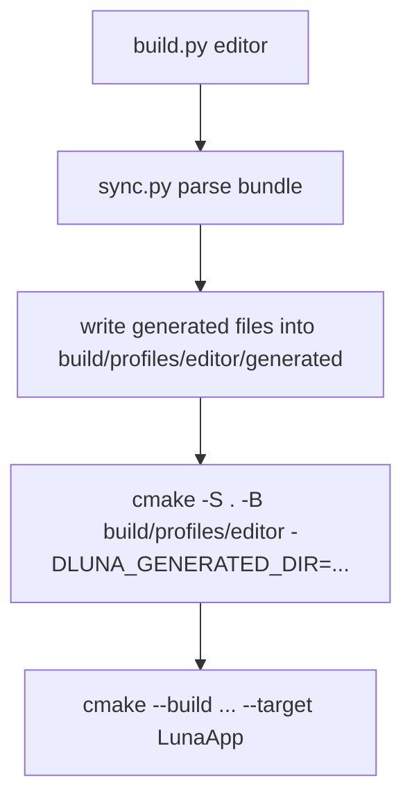

# 第三部分: 快速入门

## 安装与配置

### 环境要求

根据顶层 `CMakeLists.txt` 与当前实际构建链路，Luna 的基础要求如下:

| 项目 | 要求 |
| --- | --- |
| CMake | 3.16 或更高 |
| C++ 编译器 | 支持 C++20 |
| Vulkan SDK | 必需 |
| Python | 3.11 或更高，建议 3.13；用于 `sync.py` / `build.py` |
| 平台 | 当前主要在 Windows + GLFW 路径上验证 |

### 当前直接依赖的第三方库

| 类别 | 组件 |
| --- | --- |
| 窗口 / 输入 | GLFW |
| GUI | Dear ImGui |
| 日志 | spdlog |
| Vulkan 内存 | VMA |
| glTF | fastgltf |
| OBJ | tinyobjloader |
| 图片 | stb、tinyddsloader |
| 任务系统 | enkiTS |
| Shader 工具链 | glslang、SPIRV-Cross |
| JSON / TOML 辅助 | simdjson、tomlplusplus |

> **提示 (Note):**
> 如果你只是想构建和运行当前仓库，不需要额外安装这些依赖的系统包管理版本；仓库已经通过 `third_party/` 和 `add_subdirectory()` 管理大部分依赖。

## 获取源码

```powershell
git clone <your-repo-url> Luna
cd Luna
git submodule update --init --recursive
```

## 推荐构建方式

当前推荐直接使用:

- `Tools/luna/build.py`

而不是手工维护 `Plugins/Generated`。

### 构建 editor profile

```powershell
python Tools\luna\build.py editor
```

### 构建 runtime profile

```powershell
python Tools\luna\build.py runtime
```

### 一次性构建两套 profile

```powershell
python Tools\luna\build.py all
```

### 构建产物位置

| Profile | 生成目录 | 可执行文件 |
| --- | --- | --- |
| `editor` | `build/profiles/editor/` | `build/profiles/editor/App/Debug/LunaApp.exe` |
| `runtime` | `build/profiles/runtime/` | `build/profiles/runtime/App/Debug/LunaApp.exe` |

### `build.py` 实际做了什么



## 手工构建方式

如果你想单独控制底层步骤，也可以直接手工执行。

### 只做生成

```powershell
python Tools\luna\sync.py --project-root . --bundle Bundles/EditorDefault/luna.bundle.toml
```

### 再做 CMake 配置与构建

```powershell
cmake -S . -B build -DLUNA_GENERATED_DIR="${PWD}/Plugins/Generated"
cmake --build build --config Debug --target LunaApp
```

> **警告 (Warning):**
> raw `sync.py` 默认会把生成文件写到源码树里的 `Plugins/Generated`。  
> 日常开发更推荐 `build.py` 的 profile 隔离输出。

## 运行程序

### 运行 editor

```powershell
.\build\profiles\editor\App\Debug\LunaApp.exe
```

### 运行 runtime

```powershell
.\build\profiles\runtime\App\Debug\LunaApp.exe
```

## 首次运行时你应该看到什么

### Editor

- 原生系统窗口
- Dear ImGui 主菜单栏
- 内置 `Renderer` 面板
- `Hello` 示例面板
- `ImGui Demo` 示例面板
- 鼠标右键 + `WASD/QE/Shift` 的自由摄像机控制

### Runtime

- 原生系统窗口
- 无 editor shell
- 由 `luna.runtime.core` 创建的最小运行时场景
- 一个持续旋转的立方体静态网格

> **提示 (Note):**
> 当前默认 runtime bundle 注册的是 `RuntimeStaticMeshLayer`。
> 它会配置 `SceneRenderer` 使用插件内置 shader，创建一个最小 `Scene`，并在每帧提交旋转的立方体实体。

## 你的第一个 Luna 插件

当前最适合初学者的 Hello World 不是“自己写一整套 RenderGraph”，而是“先写一个最小 editor panel 插件”。

### 第一步: 定义一个 Panel

```cpp
#include "Editor/EditorPanel.h"
#include "imgui.h"

class HelloPanel final : public luna::editor::EditorPanel {
public:
    void onImGuiRender() override
    {
        ImGui::TextUnformatted("Hello from a Luna plugin.");
    }
};
```

### 第二步: 在注册函数里把它挂到 EditorRegistry

```cpp
#include "Editor/EditorRegistry.h"
#include "Plugin/PluginRegistry.h"

extern "C" void luna_register_my_hello(luna::PluginRegistry& registry)
{
    if (!registry.hasEditorRegistry()) {
        return;
    }

    registry.editor().addPanel<HelloPanel>("my.hello", "Hello");
}
```

### 第三步: 提供 manifest

```toml
id = "my.hello"
name = "My Hello Plugin"
version = "0.1.0"
sdk = "0.1"
kind = "editor"
cmake_target = "MyHelloPlugin"
entry = "luna_register_my_hello"
hosts = ["app"]

[dependencies]
"luna.editor.shell" = "0.1"
```

> **提示 (Note):**
> 对当前最小 panel 插件来说，依赖 `luna.editor.shell` 就够了。
> `luna.imgui` 是一个独立的 ImGui 请求插件，但它不会替你承载 panel UI。

### 第四步: 把插件加入 Bundle 并重新构建

```powershell
python Tools\luna\build.py editor
```

这个最小链路已经足够让你理解:

- 插件目录结构
- manifest
- 注册函数
- `EditorRegistry`
- Bundle 装配流程

更完整的步骤请继续阅读:

- [编写你的第一个插件](../plugins/writing-your-first-plugin.md)

## 什么时候不该从插件起步

如果你的目标是:

- 自定义整个 RenderGraph
- 自定义 renderer 初始化参数
- 做出像 `Samples/Model` 那样的完整自定义渲染路径

那么当前更适合从“自定义宿主应用”起步，而不是从插件起步。  
原因是当前插件系统还没有正式的渲染图扩展协议。

对应文档:

- [使用现有框架与 RenderGraph 构建应用](./building-an-application-with-rendergraph.md)

## 常见问题

| 现象 | 常见原因 | 解决方式 |
| --- | --- | --- |
| `sync.py: argument --bundle: expected one argument` | `--bundle` 后面漏了路径 | 补完整 bundle 路径 |
| CMake 找不到 Vulkan | Vulkan SDK 未安装或环境未刷新 | 安装 Vulkan SDK，重开终端 |
| `LunaApp` 运行但没有 editor UI | 当前构建的是 runtime profile | 构建并运行 `editor` profile |
| 插件改了但没生效 | 没重新执行 `build.py` / `sync.py` | 重新构建对应 profile |
| 改了 Bundle 后 build 还是旧内容 | 还在运行旧 build 目录 | 确认你启动的是对应 profile 的 `LunaApp.exe` |

## 快速继续阅读

- 想理解宿主怎么工作: [架构设计深度剖析](./architecture-in-depth.md)
- 想写插件: [插件系统手册](../plugins/plugin-system-manual.md)
- 想做 RenderGraph 自定义宿主: [使用现有框架与 RenderGraph 构建应用](./building-an-application-with-rendergraph.md)
