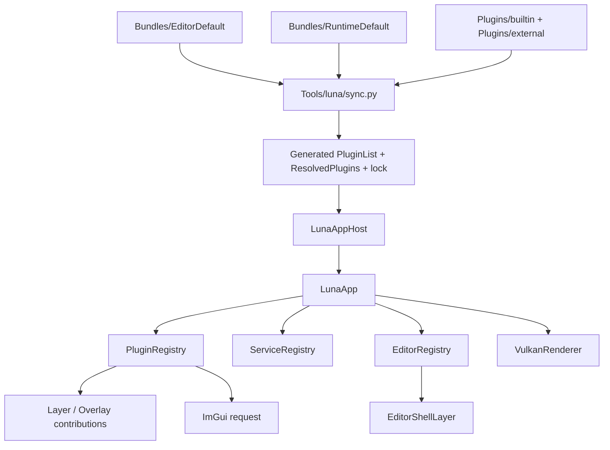
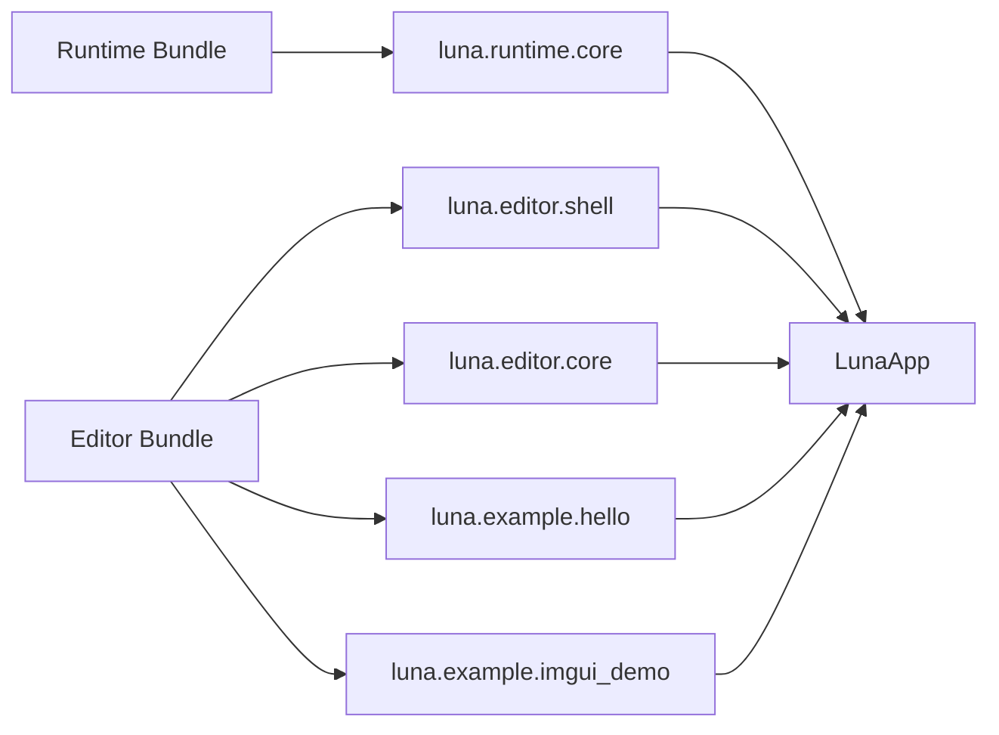

# 第一部分: 简介与核心概念

## 关于 Luna

Luna 解决的不是“如何最快做一个成品编辑器”，而是下面这类更底层的问题:

- 如何用一套清晰的 C++20 架构管理窗口、输入、主循环与渲染器生命周期
- 如何把 Vulkan 上下文、RenderGraph、资源导入能力组织成可继续扩展的底座
- 如何在**同一个宿主程序**里，通过不同插件组合得到 `runtime` 与 `editor` 形态
- 如何在不引入动态 DLL 复杂度的前提下，先把源码级插件系统做扎实

当前代码库最核心的工程目标可以概括为:

| 目标 | 当前状态 | 说明 |
| --- | --- | --- |
| 单一应用宿主 | 已实现 | `LunaApp` 是当前唯一正式宿主 |
| Bundle 驱动装配 | 已实现 | `editor` / `runtime` 都由 Bundle 选择插件 |
| 层系统与事件系统 | 已实现 | `Application + LayerStack + Event` 已稳定运行 |
| Vulkan 渲染底座 | 已实现 | `VulkanContext + RenderGraph + DescriptorBinding` 已可用 |
| 编辑器壳层 | 已实现 | `luna.editor.shell + editor plugins` 组合成 editor；`luna.imgui` 可供其他 bundle 独立请求 ImGui |
| 资源导入能力 | 已实现 | `ShaderLoader`、`ModelLoader`、`ImageLoader` 可独立使用 |
| 正式渲染插件扩展点 | 未实现 | 当前插件系统还不能正式贡献 RenderGraph / RenderPass |

> **提示 (Note):**
> Luna 当前更像“可扩展引擎骨架 + 源码插件宿主”，而不是“功能齐全的内容创作平台”。

## Luna 当前到底是什么

如果只看最终效果，很容易误以为 Luna 已经是“编辑器程序 + runtime 程序 + 插件市场”的完整体系。  
从源码反推，这个判断并不准确。

当前更准确的模型是:



换句话说:

1. `Bundle` 决定启用哪些插件。
2. `sync.py` 与 `build.py` 生成构建输入。
3. `LunaApp` 启动后显式注册插件。
4. 插件通过注册表贡献 `Layer`、`Panel`、`Command` 等能力。
5. 渲染器负责执行默认 RenderGraph 或宿主在初始化阶段提供的自定义图。

## 当前核心特性

| 特性 | 当前状态 | 说明 |
| --- | --- | --- |
| CMake 工程化构建 | 已实现 | 顶层 `CMakeLists.txt` 统一管理 |
| Windows + GLFW 原生窗口 | 已实现 | 事件桥接完整 |
| Layer / Overlay 机制 | 已实现 | 普通层与覆盖层都可由插件贡献 |
| ImGui 可选启用 | 已实现 | 由插件通过 `requestImGui()` 请求 |
| Editor shell 插件化 | 已实现 | `Editor/` 只保留框架，具体能力在 `Plugins/` |
| Vulkan RenderGraph | 已实现 | 支持声明 pass、附件、依赖、descriptor 解析 |
| Model / Shader / Image 导入 | 已实现 | `Samples/Model` 已证明渲染链可跑复杂样例 |
| Bundle profile 隔离构建 | 已实现 | `Tools/luna/build.py` 支持 `editor/runtime/all/custom` |
| 插件热重载 / DLL 加载 | 未实现 | 当前不是二进制插件系统 |

> **警告 (Warning):**
> “插件能访问某个类”不等于“插件系统正式支持这个扩展点”。  
> 例如插件当前可以在自己的 `Layer` 中访问 `Application::get().getRenderer()`，但这不意味着插件已经可以正式替换活动宿主的 RenderGraph。

## 你需要先建立的几个心智模型

### 1. `LunaApp` 是宿主，不是功能集合

`LunaApp` 的职责主要是:

- 创建服务注册表
- 创建 `EditorRegistry`
- 注册选中的插件
- 根据插件请求决定是否启用 ImGui
- 把插件贡献的 `Layer` / `Overlay` 实例化并压入层栈

它不应该继续承载大量具体业务。

### 2. `Editor/` 是框架层，不是旧应用入口

当前 `Editor/` 目录提供的是:

- `EditorPanel`
- `EditorRegistry`
- `EditorShellLayer`

也就是说:

- `Editor/` 负责定义 editor 扩展协议
- `Plugins/builtin/...` 负责提供具体 editor 功能

### 3. Bundle 是“应用组合”，不是“项目配置杂项”

当前两个默认 Bundle:

- `Bundles/EditorDefault/luna.bundle.toml`
- `Bundles/RuntimeDefault/luna.bundle.toml`

它们真正表达的是:

- 同一宿主使用哪组插件组合启动

而不是:

- 两套互不相关的程序入口

### 4. RenderGraph 目前仍由宿主控制

RenderGraph 在当前系统中的正式接入点是:

- `Application::getRendererInitializationOptions()`
- `VulkanRenderer::InitializationOptions::m_render_graph_builder`

这意味着:

- `Samples/Model` 这种能力当前是“宿主级扩展”
- 还不是“插件级扩展”

### 5. 插件系统已经可用，但扩展点还不够多

当前正式支持的贡献类型主要是:

- Layer
- Overlay
- Editor Panel
- Editor Command
- ImGui request

后续如果要继续演进，重点应该是继续增加受支持的 registry，而不是先去做二进制插件市场。

## 核心术语表

| 术语 | 含义 | Luna 中的对应 |
| --- | --- | --- |
| Host | 负责应用生命周期与插件装配的宿主程序 | `LunaApp` |
| Bundle | 决定启用哪些插件的一份清单 | `luna.bundle.toml` |
| Plugin | 带 manifest、CMake、源码和注册函数的源码模块 | `Plugins/builtin/...` |
| Layer | 每帧参与更新/事件/渲染/ImGui 的逻辑单元 | `luna::Layer` |
| Overlay | 位于普通层之后的 Layer | `pushOverlay()` |
| ServiceRegistry | 按类型索引的共享服务容器 | `luna::ServiceRegistry` |
| PluginRegistry | 插件注册期的贡献入口 | `luna::PluginRegistry` |
| EditorRegistry | Editor 侧扩展点容器 | `luna::editor::EditorRegistry` |
| Editor Panel | 由 editor shell 承载的 ImGui 面板 | `luna::editor::EditorPanel` |
| RenderPass | 一个渲染/计算通道的逻辑描述接口 | `luna::val::RenderPass` |
| RenderGraph | 由多个 pass 与命名附件组成的执行图 | `luna::val::RenderGraph` |
| RenderGraphBuilder | 根据 pass 声明构建执行图的构建器 | `luna::val::RenderGraphBuilder` |
| Virtual Frame | 一套独立的命令缓冲、同步对象和 staging 资源 | `VirtualFrameProvider` |
| Profile | 一组隔离的生成文件与 build 目录 | `build/profiles/editor` 等 |

## 当前默认 editor 与 runtime 有什么区别



差异本质上不是“程序骨架不同”，而是:

| 组合 | 当前效果 |
| --- | --- |
| `runtime` | 一个带最小 runtime layer 的纯宿主窗口 |
| `editor` | 启用 ImGui，并装配 editor shell、面板和命令 |

> **提示 (Note):**
> `luna.imgui` 是一个真实存在的 builtin 插件，但它当前不在默认 `EditorDefault` bundle 中。
> 默认 editor 之所以会启用 ImGui，是因为 `luna.editor.shell` 在注册阶段调用了 `requestImGui()`。

## 目前最容易被误解的几个点

### 1. `Renderer` 可以被插件访问，但不是正式渲染扩展协议

当前插件里的 `Layer` / `Panel` 可以直接使用:

```cpp
auto& renderer = luna::Application::get().getRenderer();
auto& camera = renderer.getMainCamera();
renderer.getClearColor().x = 0.2f;
```

这已经足够做:

- 相机控制
- clear color 调试
- 读取 renderer 基本状态

但还不够做:

- 把新 `RenderPass` 注册进当前宿主的 RenderGraph
- 替换 renderer 初始化阶段的自定义图构建器

### 2. `Samples/Model` 说明 renderer 很强，不说明插件系统已经支持它

`Samples/Model` 通过自定义 `Application` 子类，在初始化阶段注入 `RenderGraphBuilderCallback`。  
这是一个**宿主级**能力，不是当前插件系统的正式扩展点。

### 3. `sync.py` 和 `build.py` 的角色不同

| 工具 | 角色 |
| --- | --- |
| `sync.py` | 解析 Bundle 与插件 manifest，生成中间文件 |
| `build.py` | 串联 `sync -> cmake configure -> cmake build` 并为 profile 隔离输出目录 |

日常推荐入口是 `build.py`，不是直接手工维护 `Plugins/Generated`。

## 最小认知总结

如果你只记住一句话，那应该是:

> Luna 当前是一套“单宿主 + Bundle 组装 + 源码插件 + Vulkan RenderGraph 底座”的应用框架；它已经非常适合继续扩展 editor/runtime 系统，但正式的渲染插件协议还没有落地。
