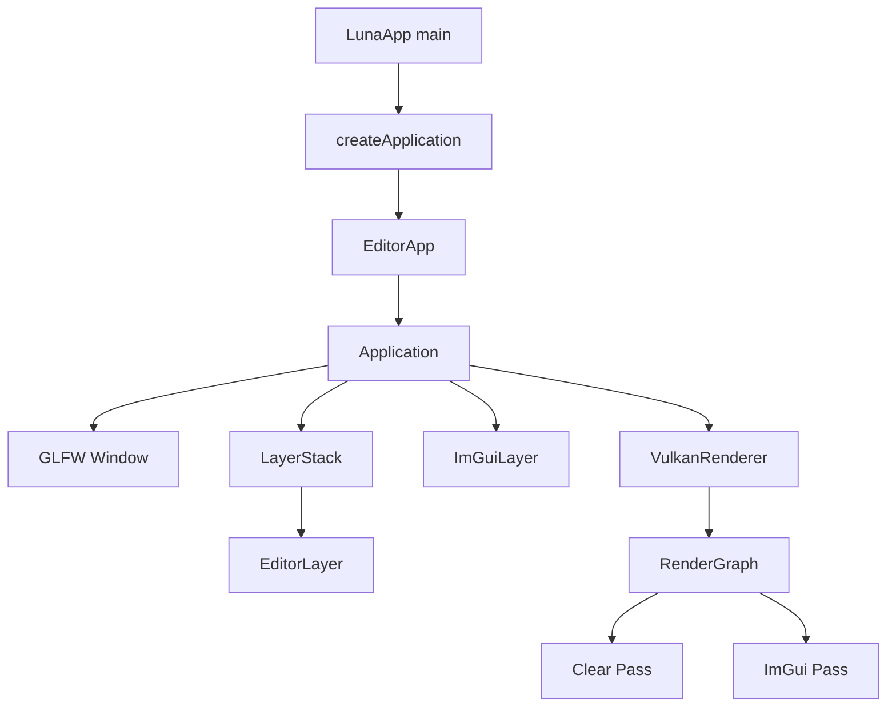

# 第一部分: 简介与核心概念

## 关于 Luna

Luna 解决的问题不是“如何快速做一个成品游戏”，而是“如何用一套相对整洁、可扩展的 C++ 架构，把窗口系统、输入事件、ImGui、Vulkan 和资源加载能力整合成一个可以继续演进的引擎底座”。

从代码结构反推，它的核心目标包括:

| 目标 | 说明 |
| --- | --- |
| 统一应用生命周期 | 通过 `Application` 管理窗口、主循环、层系统、ImGui 和渲染器 |
| 解耦平台与业务 | `Window` 是抽象接口，当前实现由 `GLFWWindow` 提供 |
| 抽象 Vulkan 复杂度 | `VulkanContext`、`RenderGraph`、`DescriptorBinding`、`StageBuffer` 等对象屏蔽大部分模板化 Vulkan 代码 |
| 提供编辑器宿主 | `EditorApp` 和 `EditorLayer` 构成默认前端壳 |
| 准备资源导入能力 | `ShaderLoader`、`ModelLoader`、`ImageLoader` 已具备独立使用价值 |

### 核心特性

| 特性 | 当前状态 | 说明 |
| --- | --- | --- |
| C++20 工程化构建 | 已实现 | 顶层 CMake 统一管理 |
| GLFW 窗口与输入 | 已实现 | 键盘、鼠标、滚轮、窗口事件完整桥接 |
| Layer/Overlay 模型 | 已实现 | 支持从业务层插入更新、渲染、ImGui 绘制逻辑 |
| ImGui Docking 集成 | 已实现 | 支持 DockSpace，预留多视口选项 |
| Vulkan 上下文与交换链 | 已实现 | 包括设备选择、交换链重建、虚拟帧管理 |
| RenderGraph | 已实现 | 能够声明通道、附件、依赖和屏障 |
| Shader 编译与反射 | 已实现 | 基于 glslang + SPIRV-Cross |
| 图片导入 | 已实现 | 支持常见图片、DDS、zlib 包装 DDS、立方体贴图 |
| 模型导入 | 已实现 | 支持 OBJ 和 glTF/GLB |
| 实际场景渲染 | 部分实现 | 默认编辑器当前只做清屏和 ImGui 通道 |

> **警告 (Warning):**
> 当前默认 `VulkanRenderer::rebuildRenderGraph()` 只构建了 `clear` 和 `imgui` 两个 pass。这意味着资源加载器虽然已经可用，但还没有被默认编辑器路径消费。

## Luna 的工作方式

下面这张图可以把 Luna 的“当前现实”讲清楚:

这不是一个“一切都往 `main()` 里堆”的项目。它的主干是:

1. `main()` 只负责初始化日志和创建应用实例。
2. `Application` 接手窗口、事件、主循环和渲染。
3. `EditorApp` 在 `onInit()` 中向层栈压入 `EditorLayer`。
4. `EditorLayer` 只实现编辑器侧的交互逻辑，例如自由摄像机控制和 ImGui 面板。
5. `VulkanRenderer` 提供当前帧的渲染执行能力。

## 核心术语表

| 术语 | 含义 | 在 Luna 中对应 |
| --- | --- | --- |
| Application | 应用宿主，管理运行生命周期 | `luna::Application` |
| Layer | 一个可插拔的逻辑单元 | `luna::Layer` |
| Overlay | 位于普通层之上的 Layer | `LayerStack::pushOverlay()` |
| Event | 窗口、键盘、鼠标等消息对象 | `luna::Event` 及其子类 |
| Window | 平台窗口抽象 | `luna::Window` |
| GLFWWindow | 当前平台窗口实现 | `luna::GLFWWindow` |
| VulkanRenderer | 引擎侧渲染入口 | `luna::VulkanRenderer` |
| VulkanContext | Vulkan 实例、设备、交换链与命令对象的管理器 | `luna::val::VulkanContext` |
| RenderPass | 一个渲染/计算通道的逻辑接口 | `luna::val::RenderPass` |
| RenderGraph | 由多个 Pass 和附件构成的执行图 | `luna::val::RenderGraph` |
| Pipeline | Pass 声明阶段生成的资源与输出描述 | `luna::val::Pipeline` |
| DescriptorBinding | 资源名到 descriptor 写入的绑定规则 | `luna::val::DescriptorBinding` |
| ResolveInfo | 运行时资源名解析表 | `luna::val::ResolveInfo` |
| StageBuffer | 每帧上传到 GPU 的暂存缓冲区 | `luna::val::StageBuffer` |
| Virtual Frame | 一套独立的命令缓冲、信号量、Fence 与 staging 资源 | `VirtualFrame` |
| Shader Reflection | 从 SPIR-V 反推输入属性和描述符布局 | `ShaderLoader` + `ShaderReflection` |

## 读懂这套源码前需要建立的心智模型

### 1. LunaCore 与 LunaEditor 是上下层关系

- `LunaCore` 提供运行时基础设施。
- `LunaEditor` 只是一个使用 `LunaCore` 的前端壳。

### 2. luna::val 是“引擎内部库”

虽然命名看起来像独立库，但它直接编译进 `LunaCore`，不是单独发布的外部二进制。

### 3. RenderGraph 是当前渲染架构的中心

Luna 不是直接在业务层写 Vulkan 命令，而是先声明资源、附件和通道，再由 `RenderGraphBuilder` 推导同步与依赖。

### 4. 资源导入层已具备独立价值

即使默认编辑器还没真正加载模型绘制，`ModelLoader`、`ImageLoader` 和 `ShaderLoader` 已经是一套可直接复用的能力集合。

## 最小认知总结

如果你只记住一句话，那么应该是:

> Luna 当前是一套“围绕 RenderGraph 组织的 Vulkan 编辑器基础框架”，而不是已经完成场景系统、材质系统和实体系统的完整引擎。
