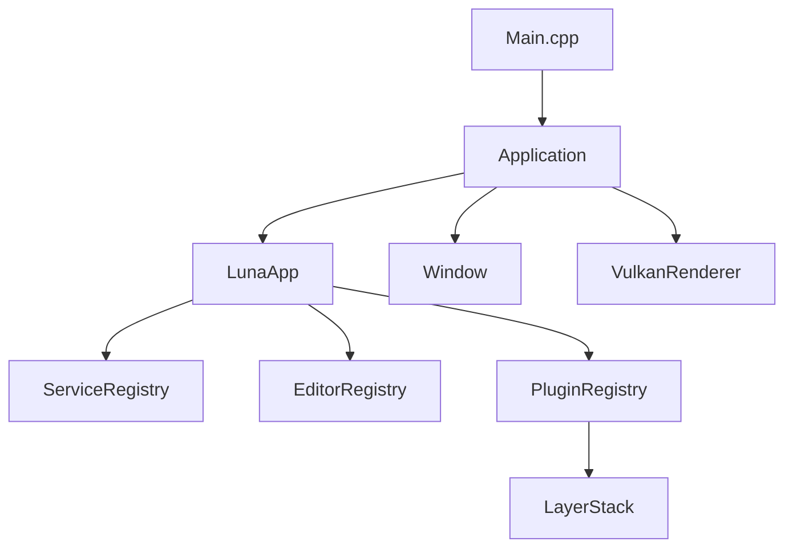
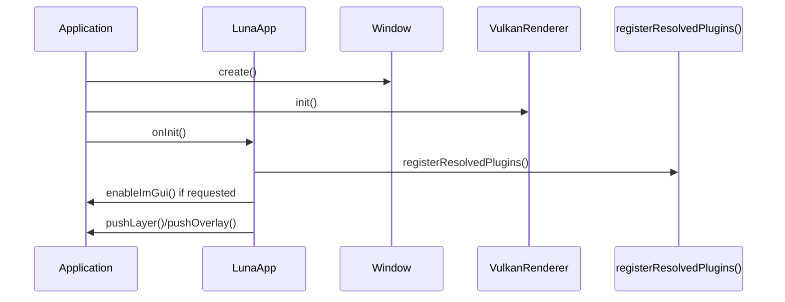
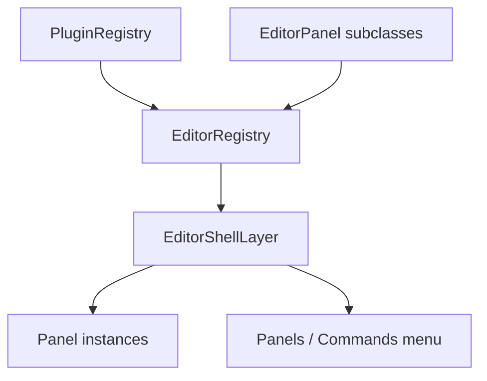
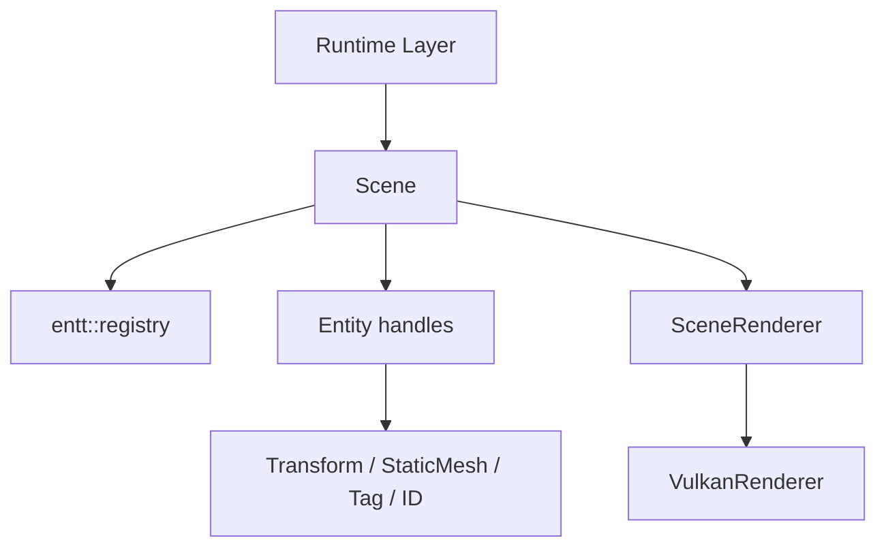
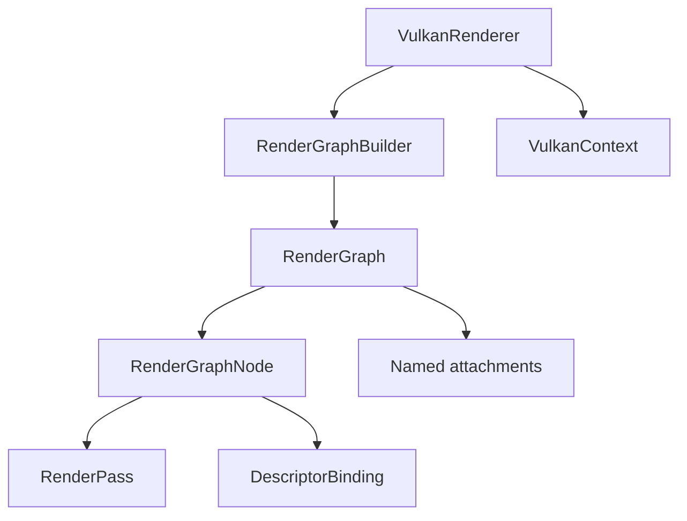
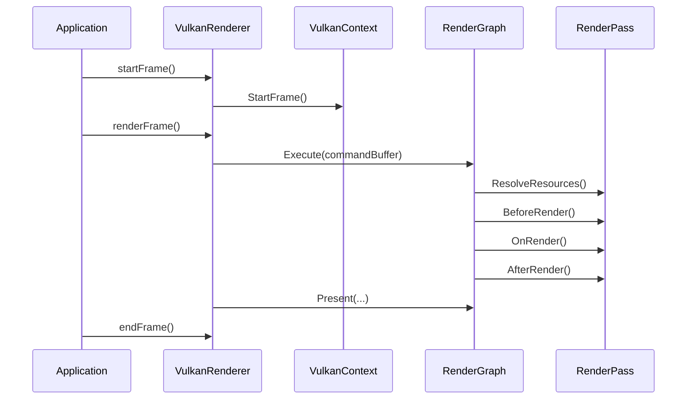
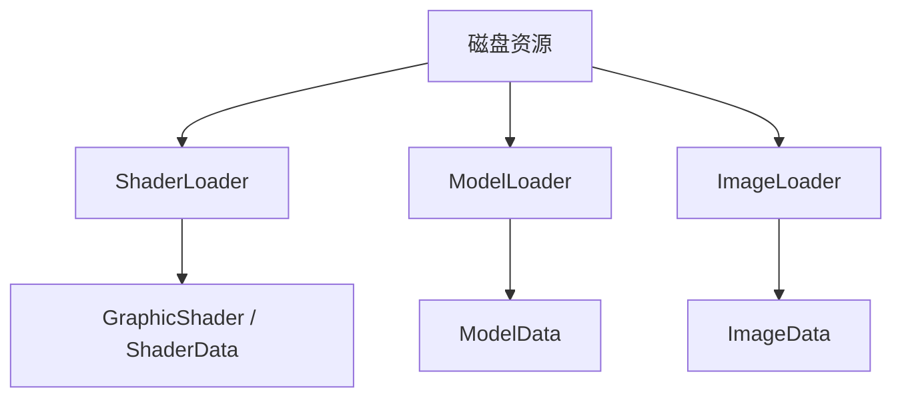
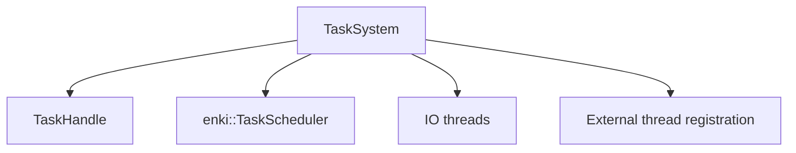
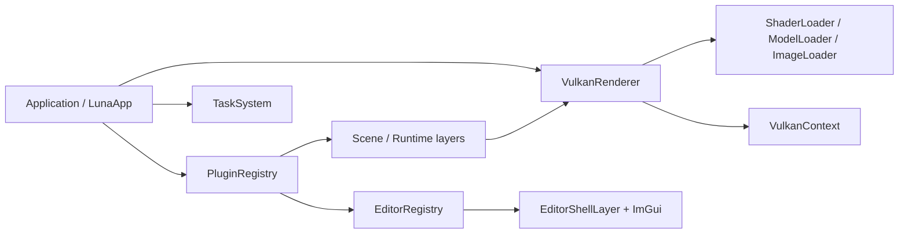

# 第四部分: 子系统解析

> **提示 (Note):**
> 本文档不追求把每个类逐行讲完，而是回答“这个子系统解决什么问题、它和其他子系统如何交互、我该怎么正确扩展它”。

## 子系统 A: App 与 Plugin Host

### 子系统目标

这个子系统负责把“程序能跑起来”这件事落地，包括:

- 创建窗口
- 初始化 renderer
- 管理主循环
- 承载插件注册与 layer 装配

### 架构图



### 核心对象

| 对象 | 作用 |
| --- | --- |
| `Application` | 定义窗口、事件、ImGui、渲染器与主循环骨架 |
| `LunaApp` | 当前正式宿主，负责插件装配 |
| `LayerStack` | 管理普通层与 overlay |
| `PluginRegistry` | 插件注册期的贡献入口 |
| `ServiceRegistry` | 为宿主与插件共享服务预留的容器 |

### 初始化过程



### 你可以怎么扩展它

#### 场景 1: 新增一个运行时 Layer

```cpp
extern "C" void luna_register_my_runtime(luna::PluginRegistry& registry)
{
    registry.addLayer("my.runtime.layer", [] {
        return std::make_unique<MyRuntimeLayer>();
    });
}
```

#### 场景 2: 在宿主里新增一个共享服务

当前 `LunaApp` 已经注册了 `EditorRegistry`。  
未来如果要让插件共享项目对象、场景对象、资产数据库，最自然的路径就是继续走 `ServiceRegistry`。

> **警告 (Warning):**
> 现在不要把具体业务逻辑继续塞回 `App/LunaApp.cpp`。  
> `LunaApp` 应该保持“装配宿主”的角色，而不是重新长回大杂烩。

## 子系统 B: Editor Framework

### 子系统目标

这个子系统负责把 ImGui + registry + menu + panel 生命周期组织成一个 editor shell。

### 架构图



### 核心对象

| 对象 | 作用 |
| --- | --- |
| `EditorPanel` | Panel 的最小接口 |
| `EditorRegistry` | 注册 panel 与 command |
| `EditorShellLayer` | 运行时实例化 panel 并渲染主菜单栏 |

### 当前已经支持的 editor 扩展协议

| 能力 | 当前是否支持 |
| --- | --- |
| Panel 注册 | 支持 |
| Command 注册 | 支持 |
| Menu item registry | 不支持 |
| Toolbar item registry | 不支持 |
| Inspector provider | 不支持 |

### 一个 editor panel 插件的最小链路

```cpp
class HelloPanel final : public luna::editor::EditorPanel {
public:
    void onImGuiRender() override
    {
        ImGui::TextUnformatted("Hello.");
    }
};

extern "C" void luna_register_my_editor(luna::PluginRegistry& registry)
{
    registry.requestImGui();
    registry.editor().addPanel<HelloPanel>("my.hello", "Hello");
}
```

### 当前的边界为什么合理

当前 editor framework 已经做到了:

- 宿主只负责承载 editor shell
- 具体 editor 功能在插件里实现

这让后续继续演进:

- Asset Browser
- Scene Editor
- Inspector
- Toolbar

都可以继续保持在 `Plugins/` 下，而不是重新塞回 `Editor/`。

## 子系统 C: Scene 与 Runtime Scene

### 子系统目标

这个子系统负责把“运行时世界状态”和“默认 scene render path”之间的桥接做成最小可用闭环，包括:

- 用 `entt` 承载 entity/component 生命周期
- 提供 `Entity` 包装，简化组件增删查改
- 在 `Scene::onUpdateRuntime()` 中把可见静态网格提交给 `SceneRenderer`

### 架构图



### 核心对象

| 对象 | 作用 |
| --- | --- |
| `Scene` | 拥有 `entt::registry`，负责创建/销毁实体并在运行时提交可见静态网格 |
| `Entity` | 轻量句柄，封装组件访问与基本标识读取 |
| `TransformComponent` | 保存平移/旋转/缩放，并可生成模型矩阵 |
| `StaticMeshComponent` | 保存 `Mesh`、`Material` 与可见性 |
| `IDComponent` / `TagComponent` | 分别提供 UUID 与名称 |

### 当前默认 runtime 插件如何使用它

`luna.runtime.core` 当前注册的是 `RuntimeStaticMeshLayer`。它会:

- 配置 `SceneRenderer::ShaderPaths` 指向插件内置 shader
- 调用 `requestRenderGraphRebuild()` 让默认渲染图重新解析 shader 资源
- 创建一个最小 `Scene`
- 创建名为 `runtime_cube` 的 entity，并挂上 `TransformComponent` 与 `StaticMeshComponent`
- 在 `onUpdate()` 里旋转实体并调用 `Scene::onUpdateRuntime()`

### 当前这层已经实现什么

- 最小 entity/component 生命周期
- 基于 `TransformComponent + StaticMeshComponent` 的静态网格提交流程
- 与默认 `VulkanRenderer` / `SceneRenderer` 主路径的衔接

### 当前还没实现什么

- 层级关系 / parent-child transform
- 场景内 camera/light 组件系统
- 序列化、资源引用解析、editor scene service

## 子系统 D: Renderer 与 RenderGraph

### 子系统目标

这个子系统负责把“一帧 GPU 工作”组织成明确的 RenderGraph，而不是把 Vulkan 命令直接散落在业务层。

### 架构图



### 关键流程



### `RenderGraphBuilder` 的价值

它主要解决三件事:

1. 帮你从 pass 声明推导资源依赖
2. 帮你分配附件图像
3. 帮你自动生成 Vulkan 屏障与原生 render pass / framebuffer

### 当前默认宿主的渲染现实

默认 `LunaApp` 当前会把 RenderGraph 构建委托给 `SceneRenderer`。

在 scene shader 与核心资源可用时，默认图是:

- `scene_geometry`
- `scene_lighting`
- optional imgui
- present

如果 scene shader 加载失败，或 `SceneRenderer` 核心资源没有成功初始化，则会回退到:

- `scene_clear`
- optional imgui
- present

所以:

- renderer 底座已经很强
- 默认宿主已经带有最小 scene 渲染主路径

### 当前最重要的限制

虽然插件中的 Layer/Panel 可以直接访问:

```cpp
auto& renderer = luna::Application::get().getRenderer();
```

但当前插件系统**还没有**正式的:

- `RenderGraphContribution`
- `RenderFeatureRegistry`
- `RenderPass` 注入协议

当前插件还可以进一步使用:

```cpp
auto& renderer = luna::Application::get().getRenderer();
renderer.getSceneRenderer().setShaderPaths(shader_paths);
renderer.requestRenderGraphRebuild();
```

这足够完成:

- 相机控制
- clear color 调整
- 默认 scene renderer shader 资源切换

但它仍然不等于“插件已经正式拥有 RenderGraph builder / RenderPass 注入协议”。

因此 `Samples/Model` 那种完整自定义渲染路径，当前仍然是宿主级扩展，而不是插件级扩展。

## 子系统 E: Asset 导入与资源工具

### 子系统目标

把磁盘上的 shader / model / image 资源转成 renderer 可以消费的数据。

### 架构图



### 当前已经可用的导入器

| 导入器 | 输入 | 输出 |
| --- | --- | --- |
| `ShaderLoader` | GLSL / SPIR-V | `ShaderData` |
| `ModelLoader` | OBJ / glTF / GLB | `ModelData` |
| `ImageLoader` | 常见图片 / DDS | `ImageData` |

### 使用场景示例

```cpp
const auto model = luna::val::ModelLoader::Load("assets/material_sphere/material_sphere.obj");
auto shader = std::make_shared<luna::val::GraphicShader>();
shader->Init(
    luna::val::ShaderLoader::LoadFromSourceFile("Model.vert", luna::val::ShaderType::VERTEX, luna::val::ShaderLanguage::GLSL),
    luna::val::ShaderLoader::LoadFromSourceFile("Model.frag", luna::val::ShaderType::FRAGMENT, luna::val::ShaderLanguage::GLSL));
```

### 当前还没形成什么

当前有“导入能力”，但还没有“正式资产系统”。

也就是说，现在还没有:

- `AssetRegistry`
- importer 插件注册
- 统一资产数据库
- 预览图 registry

这是下一阶段很值得做的一块。

## 子系统 F: JobSystem

### 子系统目标

提供可组合的任务调度能力，而不是把一切后台工作塞进 ad-hoc 线程。

### 架构图



### 当前暴露给上层的核心能力

| 能力 | 对应 API |
| --- | --- |
| 提交普通任务 | `submit(...)` |
| 提交并行任务 | `submitParallel(...)` |
| 任务依赖 | `then(...)`, `whenAll(...)` |
| 主线程 / IO 目标选择 | `TaskSubmitDesc::target` |
| 外部线程注册 | `registerExternalThread()` |

### 使用场景示例

```cpp
auto& tasks = luna::Application::get().getTaskSystem();

auto a = tasks.submit([] {
    // do work
});

auto b = a.then(tasks, [] {
    // run after a
});

b.wait(tasks);
```

更多细节请直接阅读:

- [job-system-manual.md](./job-system-manual.md)

## 子系统之间如何协作



### 当前最有价值的协作关系

| 关系 | 价值 |
| --- | --- |
| `LunaApp -> PluginRegistry -> LayerStack` | 把宿主与插件装配彻底串起来 |
| `EditorRegistry -> EditorShellLayer` | 把 editor 功能从宿主代码中剥离出来 |
| `Scene -> SceneRenderer` | 把 entity/component 世界状态转成默认 scene draw submission |
| `VulkanRenderer -> RenderGraph -> VulkanContext` | 把“图组织”与“原生资源”分层 |
| `TaskSystem -> Application` | 让宿主天然具备后台任务能力 |

## 一句话总结

Luna 当前的子系统布局已经非常清楚:

> App 子系统负责生命周期，Plugin 子系统负责扩展声明，Editor 子系统负责 UI 壳层，Renderer 子系统负责帧组织，Vulkan 子系统负责原生资源，Asset 与 JobSystem 负责支撑能力。
