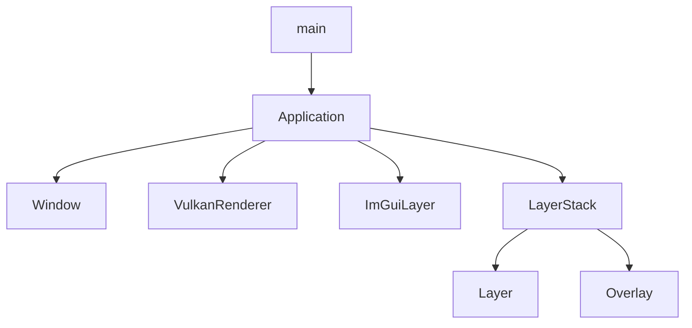
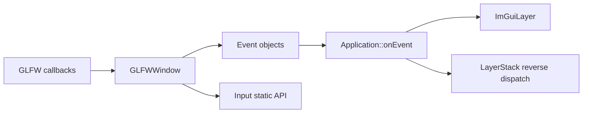
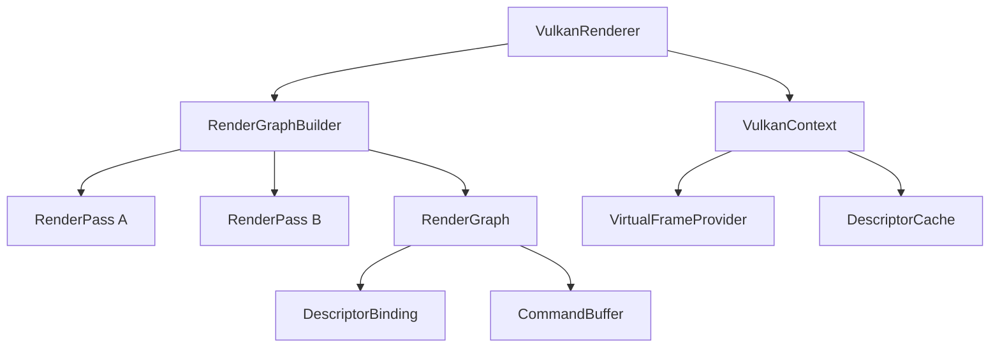
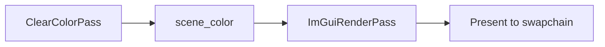
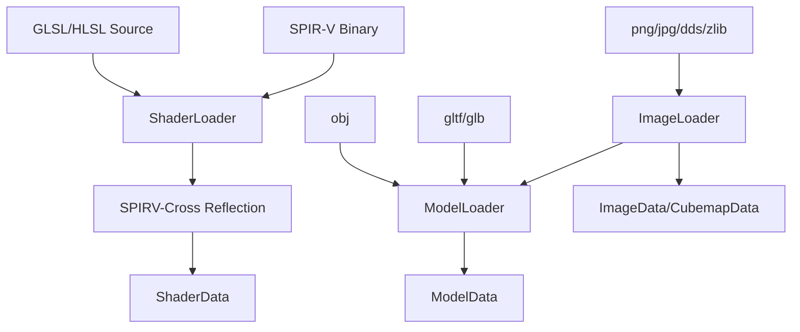
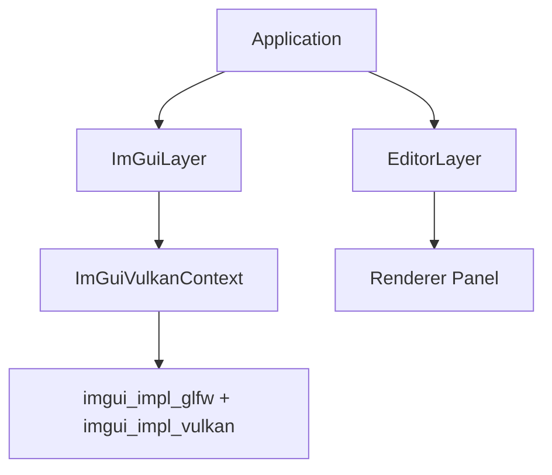

# 第四部分: 子系统解析

## 模块 A 教程: 应用运行时与层系统

### 模块架构图



### 原理解释

`Application` 是整个项目的中控器。它把不同子系统组合到一起:

- `Window` 负责原生窗口
- `VulkanRenderer` 负责帧渲染
- `ImGuiLayer` 负责 GUI 帧生命周期
- `LayerStack` 负责承载业务逻辑

`LayerStack` 内部用一个插入索引区分普通 Layer 和 Overlay:

- 普通 Layer 插入到前半段
- Overlay 永远追加到末尾

### 初始化过程

```cpp
void EditorApp::onInit() {
    pushLayer(std::make_unique<EditorLayer>());
}
```

### 常用场景代码示例

```cpp
class GameplayLayer final : public luna::Layer {
public:
    GameplayLayer() : Layer("GameplayLayer") {}

    void onUpdate(luna::Timestep dt) override {
        // 这里写游戏或工具逻辑
    }
};
```

## 模块 B 教程: 平台窗口、事件与输入系统

### 模块架构图



### 原理解释

Luna 把 GLFW 适配成两条并行路径:

1. 回调转为 `Event` 对象，进入事件系统
2. `Input` 静态接口从当前活动窗口即时查询状态

### 常用场景代码示例

```cpp
if (luna::Input::isKeyPressed(luna::KeyCode::W)) {
    // 前进
}
```

```cpp
void onEvent(luna::Event& event) override {
    luna::EventDispatcher dispatcher(event);
    dispatcher.dispatch<luna::WindowResizeEvent>([](auto& e) {
        return false;
    });
}
```

## 模块 C 教程: 渲染器与 RenderGraph

### 模块架构图



### 原理解释

`VulkanRenderer` 的职责不是写死所有绘制逻辑，而是:

1. 初始化 `VulkanContext`
2. 根据窗口尺寸构建或重建 RenderGraph
3. 驱动一帧的开始、执行、呈现和结束

当前默认 RenderGraph 非常简单:



### 常用场景代码示例

```cpp
class MyPass final : public VulkanAbstractionLayer::RenderPass {
public:
    void SetupPipeline(PipelineState pipeline) override {
        pipeline.DeclareAttachment(
            "my_color",
            VulkanAbstractionLayer::Format::R8G8B8A8_UNORM,
            0,
            0);
        pipeline.AddOutputAttachment(
            "my_color",
            VulkanAbstractionLayer::ClearColor{0.1f, 0.2f, 0.3f, 1.0f});
    }
};
```

```cpp
VulkanAbstractionLayer::RenderGraphBuilder builder;
builder
    .AddRenderPass("my_pass", std::make_unique<MyPass>())
    .SetOutputName("my_color");

auto graph = builder.Build();
```

> **警告 (Warning):**
> `RenderGraphBuilder` 依赖 pass 声明来推导资源使用状态。如果你绕过它直接手工改 layout，同步关系就会变得不可靠。

## 模块 D 教程: 资源导入与着色器工具链

### 模块架构图



### 原理解释

这一层目前更像“工具箱”而不是“运行时场景系统”:

| 工具 | 输入 | 输出 |
| --- | --- | --- |
| `ShaderLoader` | 源码或 SPIR-V | `ShaderData` |
| `ModelLoader` | `.obj`, `.gltf`, `.glb` | `ModelData` |
| `ImageLoader` | 图片文件或内存块 | `ImageData`, `CubemapData` |

### 常用场景代码示例

```cpp
auto image = VulkanAbstractionLayer::ImageLoader::LoadImageFromFile("assets/head.jpg");
auto model = VulkanAbstractionLayer::ModelLoader::Load("assets/basicmesh.glb");
```

```cpp
auto shader = VulkanAbstractionLayer::ShaderLoader::LoadFromSourceFile(
    "Shaders/Internal/mesh.vert",
    VulkanAbstractionLayer::ShaderType::VERTEX,
    VulkanAbstractionLayer::ShaderLanguage::GLSL);
```

## 模块 E 教程: ImGui 与编辑器集成

### 模块架构图



### 原理解释

这里有两个层次:

- `ImGuiLayer` 负责引擎级别的 ImGui 生命周期
- `EditorLayer` 负责具体的编辑器窗口内容

### 常用场景代码示例

```cpp
void onImGuiRender() override {
    if (ImGui::Begin("Tools")) {
        ImGui::TextUnformatted("Custom editor tool");
    }
    ImGui::End();
}
```

```cpp
Application::get().getImGuiLayer()->blockEvents(true);
```

## 子系统关系总结

> `Application` 负责驱动，`Platform` 负责感知输入，`Renderer` 负责组织 GPU 工作，`Vulkan` 负责落地资源和命令，`Editor` 与 `ImGui` 负责把这些能力呈现成可交互工具。
