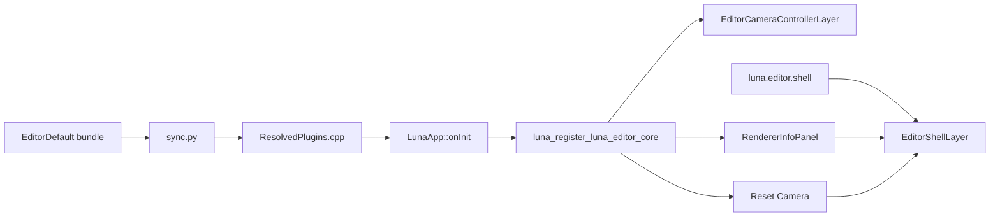
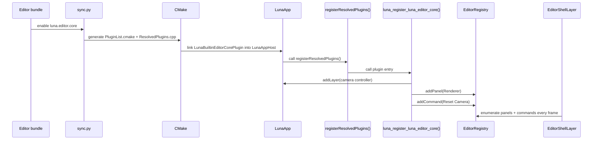

# builtin 插件 `luna.editor.core` 逐文件讲解

## 1. 为什么要先看这个插件

`luna.editor.core` 不是概念样例，而是当前默认 editor 组合里真实在工作的插件。

它的重要性在于:

- 它处在默认 editor bundle 中
- 它同时演示了 `Layer`、`Panel`、`Command` 三类贡献
- 它很好地体现了“宿主框架”和“具体插件能力”之间的边界

如果你要理解 Luna 当前插件系统最真实的落点，从这个插件入手是最有效的。

## 2. 它在整个系统中的位置



这个图表达了两个关键事实:

1. `luna.editor.core` 不是宿主，它只是被宿主装配的一个插件。
2. 它依赖 `luna.editor.shell` 来承载 panel 和 command 的 UI 表现。

## 3. 目录结构

```text
Plugins/builtin/luna.editor.core/
├─ luna.plugin.toml
├─ CMakeLists.txt
└─ src/
   ├─ BuiltinEditorCorePlugin.cpp
   ├─ EditorCameraControllerLayer.h
   ├─ RendererInfoPanel.h
   └─ RendererInfoPanel.cpp
```

## 4. manifest 解读

当前 manifest 内容如下:

```toml
id = "luna.editor.core"
name = "Builtin Editor Core"
version = "0.1.0"
sdk = "0.1"
kind = "editor"
cmake_target = "LunaBuiltinEditorCorePlugin"
entry = "luna_register_luna_editor_core"
hosts = ["app"]

[dependencies]
"luna.editor.shell" = "0.1"
```

### 4.1 这份 manifest 说明了什么

| 字段 | 说明 |
| --- | --- |
| `id = "luna.editor.core"` | 这是默认 editor 功能集合插件 |
| `kind = "editor"` | 它属于 editor 方向插件 |
| `hosts = ["app"]` | 当前它运行在单宿主 `LunaApp` 上 |
| `entry = "luna_register_luna_editor_core"` | 宿主最终会调用这个入口函数 |
| `dependencies["luna.editor.shell"]` | 它依赖 editor shell 来承载 panel 与 command |

### 4.2 为什么依赖 `luna.editor.shell`

因为 `luna.editor.core` 自己只负责注册贡献:

- camera controller layer
- Renderer panel
- Reset Camera command

真正负责把 panel 和 command 组织成 UI 的，是 `luna.editor.shell` 注册的 `EditorShellLayer`。

## 5. `CMakeLists.txt` 解读

当前核心构建逻辑非常直接:

```cmake
add_library(
    LunaBuiltinEditorCorePlugin
    STATIC
    luna.plugin.toml
    src/BuiltinEditorCorePlugin.cpp
    src/EditorCameraControllerLayer.h
    src/RendererInfoPanel.h
    src/RendererInfoPanel.cpp
)

target_link_libraries(
    LunaBuiltinEditorCorePlugin
    PUBLIC
        LunaEditorFramework
)
```

### 5.1 这个构建文件传递出的架构信号

它说明了三件事:

1. `luna.editor.core` 是独立插件 target，不是 `Editor/` 目录里的普通宿主源码。
2. 它依赖的是 `LunaEditorFramework`，也就是 editor framework，而不是某个“编辑器专用可执行程序”。
3. 它最终会由 `App/CMakeLists.txt` 中的 `LunaAppHost` 链接进去，而不是被一个不存在的 `LunaEditor` 程序直接编译进去。

这正是当前架构最重要的边界之一:

- `Editor/` 负责协议
- `Plugins/builtin/luna.editor.core` 负责具体能力

## 6. `BuiltinEditorCorePlugin.cpp`

这是插件的注册入口文件，也是整条链路的核心。

当前入口签名是:

```cpp
extern "C" void luna_register_luna_editor_core(luna::PluginRegistry& registry)
```

它做了三件事:

1. 注册一个 camera controller layer
2. 如果 editor registry 可用，注册一个 Renderer panel
3. 如果 editor registry 可用，注册一个 Reset Camera command

### 6.1 Layer 注册

```cpp
registry.addLayer("luna.editor.camera_controller", [] {
    return std::make_unique<luna::editor::EditorCameraControllerLayer>();
});
```

这说明:

- 插件提交的是工厂，不是现成对象
- 真正实例化发生在宿主装配阶段

### 6.2 Panel 注册

```cpp
editor_registry.addPanel<luna::editor::RendererInfoPanel>(
    "luna.editor.renderer",
    "Renderer",
    true);
```

这说明:

- 插件向 `EditorRegistry` 注册了一个名为 `Renderer` 的面板
- 面板默认打开

### 6.3 Command 注册

```cpp
editor_registry.addCommand("luna.editor.reset_camera", "Reset Camera", [] {
    resetMainCamera();
});
```

这说明:

- 插件还可以为 editor shell 提供菜单命令
- 命令逻辑和 UI 展示仍然是分离的

### 6.4 这个文件体现出的设计价值

这个注册文件之所以重要，是因为它把“插件声明贡献”和“宿主管理生命周期”彻底分开了。

插件在这里做的是声明:

- 我提供一个 layer
- 我提供一个 panel
- 我提供一个 command

宿主稍后再决定:

- 何时创建对象
- 何时压栈
- 何时销毁

## 7. `EditorCameraControllerLayer.h`

这个文件定义了一个持续运行的交互层。

### 7.1 它负责什么

当前职责包括:

- 检查右键是否按下
- 切换鼠标锁定 / 原始输入
- 读取 `WASD/QE/Shift`
- 更新主相机的位置与欧拉角

### 7.2 它为什么应该是 Layer 而不是 Panel

因为它本质上是持续每帧执行的交互逻辑，而不是一个单纯的 UI 窗口。

这正是当前 Layer 最适合承载的场景:

- 输入逻辑
- 相机控制
- 每帧状态更新

### 7.3 它说明插件已经可以访问 renderer 运行时状态

这个 Layer 直接通过:

```cpp
auto& camera = luna::Application::get().getRenderer().getMainCamera();
```

拿到了主相机，并在 `onUpdate()` 中修改它。

这说明当前插件已经能够:

- 访问 renderer 暴露出的状态对象
- 做相机控制这类高层业务逻辑

但这仍然不等于:

- 插件已经正式支持 RenderGraph 主路径扩展

## 8. `RendererInfoPanel.*`

这个面板是理解“插件可以访问 renderer 到什么程度”的最好例子之一。

### 8.1 它当前显示什么

面板里会显示并编辑:

- clear color
- 相机位置
- 相机 pitch / yaw
- 输入操作提示

### 8.2 它怎么做到的

核心逻辑就是:

```cpp
auto& renderer = luna::Application::get().getRenderer();
ImGui::ColorEdit4("Clear Color", &renderer.getClearColor().x);
```

这说明当前插件里的 panel 已经能直接操作 renderer 的一部分运行时状态。

### 8.3 这个面板的架构意义

它很好地证明了当前插件系统已经足以支持:

- 参数调节窗口
- renderer 状态监视
- 编辑器控制台式面板

也进一步说明:

- 很多工具型能力不需要改宿主
- 直接写成 panel 插件就够了

## 9. 它如何被宿主真正使用

完整链路如下:



## 10. 为什么它叫 `editor.core`

因为它当前承担的是“默认编辑器最小能力集合”的角色，而不是“所有编辑器功能都往里堆的大包”。

它更合理的长期定位应当是:

- 只保留 editor 默认必需的极少数基础能力

其他方向则继续拆成独立插件，例如:

- viewport
- asset browser
- scene editor
- inspector

## 11. 从这个插件可以学到什么

### 11.1 小型 UI 能力优先做成 Panel

像 `RendererInfoPanel` 这种纯展示与调参窗口，没有必要升格成 Layer。

### 11.2 持续输入逻辑优先做成 Layer

像 camera controller 这种持续更新行为，放进 Layer 非常自然。

### 11.3 命令和界面可以解耦

`Reset Camera` 通过 `Command` 暴露，而不是硬编码在某个窗口按钮里。  
这让后面继续扩展菜单、快捷键、命令面板会更容易。

### 11.4 插件不需要接管宿主，仍然能深度影响行为

`luna.editor.core` 没有创建窗口，也没有接管主循环，但它仍然实质改变了默认 editor 的操作方式。

这正说明当前插件系统已经进入“可用骨架”阶段。

## 12. 一句话总结

`luna.editor.core` 的价值不只是“做了一个 Renderer 面板”，而是它证明了这条链路已经稳定成立:

> Bundle 选择插件 -> `sync.py` 生成构建与注册文件 -> `LunaApp` 调用插件入口 -> 插件提交 layer/panel/command -> editor shell 把这些贡献变成真正的编辑器行为。
