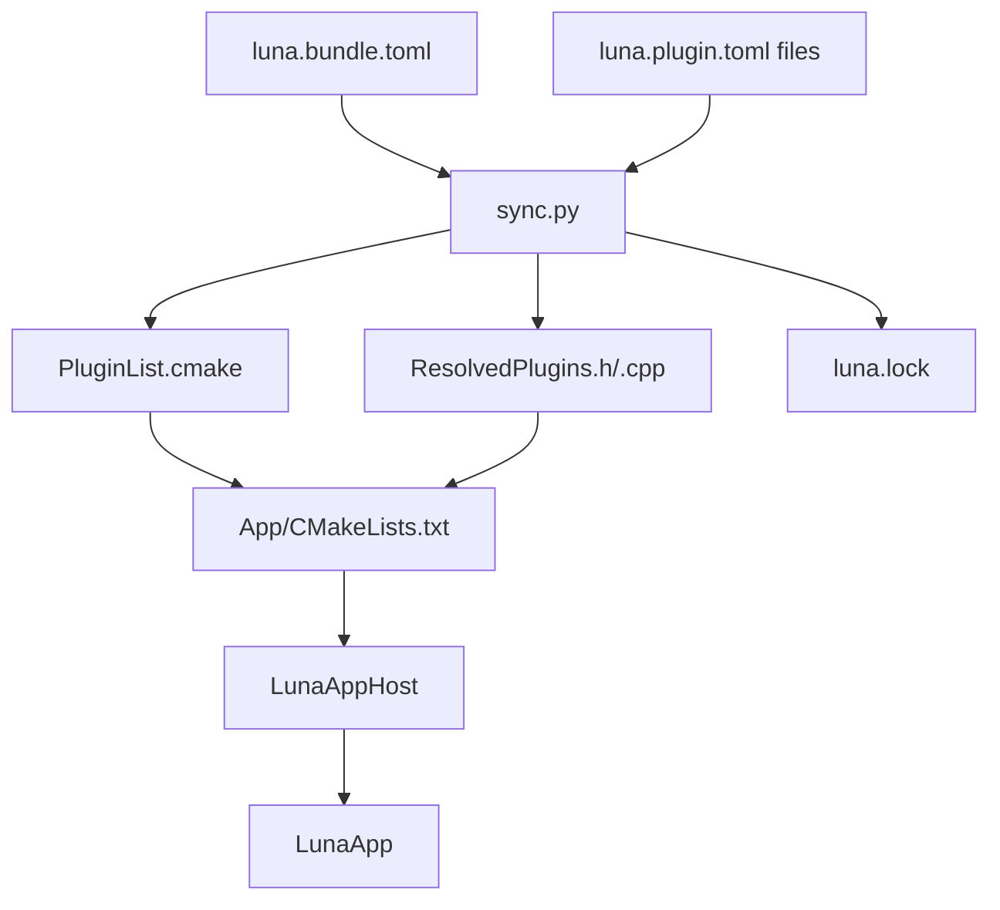
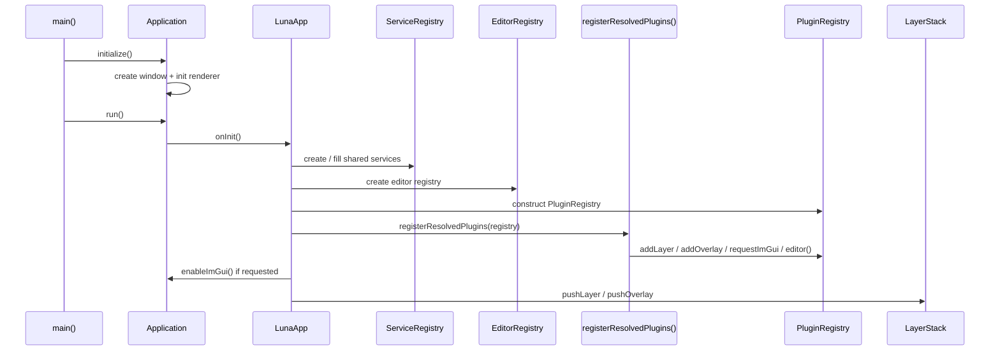
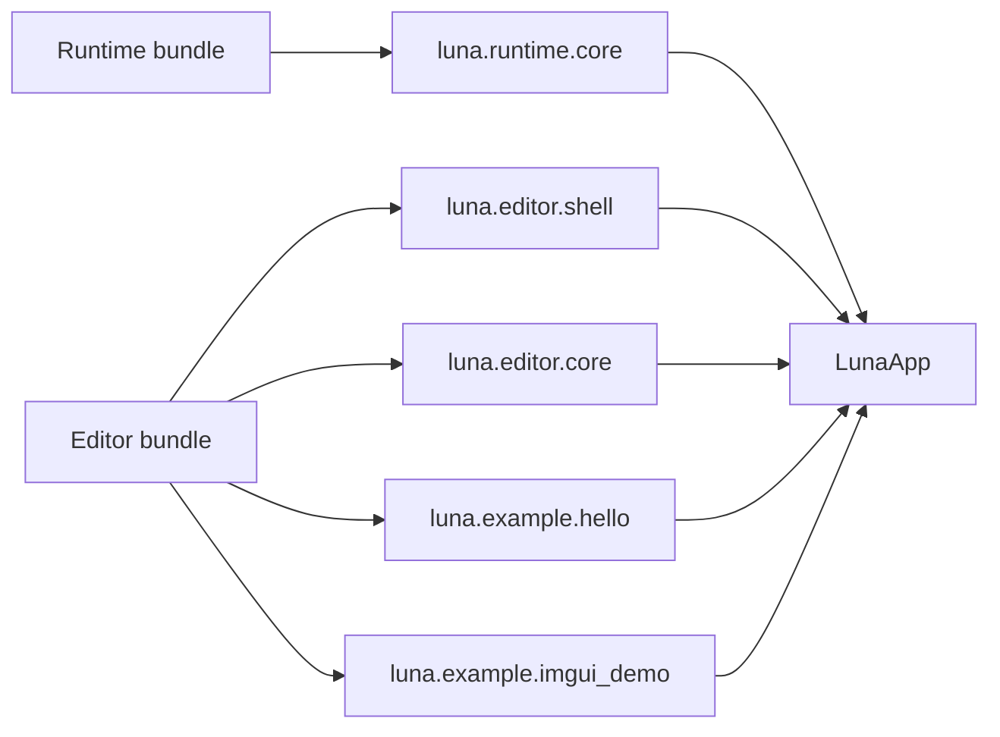

# Luna 插件系统手册

> **提示 (Note):**
> 这份手册描述的是 Luna 当前仓库中已经实现、已经验证、已经进入构建链路的插件系统。
> 它不是“未来完整插件生态”的设计稿，而是“现在这套系统到底怎么工作”的实现手册。

## 1. 一句话定义

Luna 当前的插件系统本质上是:

> 本地源码插件 + Bundle 选择 + `sync.py` 生成构建输入 + 宿主启动时显式注册

它当前不是:

- 二进制 DLL 插件系统
- 热重载插件系统
- 远程下载与版本求解生态

## 2. 插件系统当前解决什么问题

Luna 当前要解决的核心问题，不是“如何动态加载一个库”，而是下面四件更基础也更关键的事:

1. 让宿主根据 Bundle 决定启用哪些插件。
2. 让插件以源码模块的形式稳定进入 CMake 构建图。
3. 让插件通过显式入口函数声明自己的贡献。
4. 让同一个 `LunaApp` 通过不同插件组合表现成 runtime 或 editor。

## 3. 当前能力边界总表

| 能力 | 当前状态 | 说明 |
| --- | --- | --- |
| 本地插件扫描 | 已实现 | 扫描 `Plugins/builtin` 与 `Plugins/external` |
| Bundle 驱动插件选择 | 已实现 | `luna.bundle.toml` 决定启用列表 |
| 依赖拓扑排序 | 已实现 | 按 `dependencies` 的 key 解析 |
| host 兼容校验 | 已实现 | Bundle `host` 对插件 `hosts` |
| 生成 `PluginList.cmake` | 已实现 | 供宿主 target 引入插件目标 |
| 生成 `ResolvedPlugins.cpp` | 已实现 | 显式聚合插件入口 |
| 启动时注册插件 | 已实现 | `LunaApp::onInit()` 调用 `registerResolvedPlugins()` |
| `Layer` / `Overlay` 贡献 | 已实现 | 通过 `PluginRegistry` |
| `Panel` / `Command` 贡献 | 已实现 | 通过 `EditorRegistry` |
| ImGui 请求 | 已实现 | `PluginRegistry::requestImGui()` |
| RenderGraph 正式插件注入 | 未实现 | 当前没有 render registry |
| 二进制插件 / 动态加载 | 未实现 | 当前全部源码编译 |
| 热重载 | 未实现 | 当前没有运行时卸载/重载协议 |

## 4. 核心术语

| 术语 | 含义 | 当前实现 |
| --- | --- | --- |
| Host | 负责生命周期与装配的应用宿主 | `LunaApp` |
| Bundle | 一份启用插件清单 | `Bundles/*/luna.bundle.toml` |
| Plugin | 带 manifest、CMake、源码和入口函数的模块 | `Plugins/builtin/*`、`Plugins/external/*` |
| Generated Files | `sync.py` 生成的构建与注册中间文件 | `PluginList.cmake`、`ResolvedPlugins.*`、`luna.lock` |
| Contribution | 插件提交给宿主的能力声明 | `Layer`、`Overlay`、`Panel`、`Command`、ImGui request |

## 5. 物理目录布局

```text
Luna/
├─ App/
│  ├─ CMakeLists.txt
│  └─ LunaApp.cpp
├─ Bundles/
│  ├─ EditorDefault/luna.bundle.toml
│  └─ RuntimeDefault/luna.bundle.toml
├─ Editor/
│  ├─ EditorPanel.h
│  ├─ EditorRegistry.h/.cpp
│  └─ EditorShellLayer.h/.cpp
├─ Luna/
│  └─ Plugin/
│     ├─ PluginBootstrap.h
│     ├─ PluginRegistry.h/.cpp
│     └─ ServiceRegistry.h
├─ Plugins/
│  ├─ builtin/
│  │  ├─ luna.imgui/
│  │  ├─ luna.editor.shell/
│  │  ├─ luna.editor.core/
│  │  ├─ luna.example.hello/
│  │  ├─ luna.example.imgui_demo/
│  │  └─ luna.runtime.core/
│  ├─ external/
│  └─ Generated/
└─ Tools/
   └─ luna/
      ├─ sync.py
      └─ build.py
```

### 当前各层职责

| 路径 | 角色 |
| --- | --- |
| `App/` | 宿主 target，接入 generated 文件，装配插件贡献 |
| `Editor/` | editor framework，不是具体插件 |
| `Luna/Plugin/` | 运行时注册表与服务容器 |
| `Plugins/` | 具体插件实现 |
| `Tools/luna/` | Bundle 解析、生成文件、构建驱动 |

## 6. 插件系统的两条主链路

插件系统可以拆成两条链路看:

1. 构建期链路
2. 运行时链路

### 6.1 构建期链路



### 6.2 运行时链路



## 7. Bundle 是如何描述插件组合的

### 7.1 当前 Bundle 文件

当前默认 Bundle 有两份:

- `Bundles/EditorDefault/luna.bundle.toml`
- `Bundles/RuntimeDefault/luna.bundle.toml`

它们不是两个不同宿主，而是同一个 `LunaApp` 的两种插件组合。

### 7.2 Bundle 字段表

| 字段 | 类型 | 当前作用 |
| --- | --- | --- |
| `id` | string | 元数据，写入解析结果 |
| `name` | string | 元数据 |
| `version` | string | 元数据 |
| `sdk` | string | 写入 lock file，当前不做严格兼容求解 |
| `host` | string | 参与 host 兼容校验 |
| `[plugins].enabled` | string array | 决定最终启用哪些插件 |

### 7.3 默认 Bundle 的真实内容

| Bundle | 当前启用插件 | 结果 |
| --- | --- | --- |
| `EditorDefault` | `luna.editor.shell`、`luna.editor.core`、`luna.example.hello`、`luna.example.imgui_demo` | 启用 editor shell、默认编辑器能力和两个示例面板 |
| `RuntimeDefault` | `luna.runtime.core` | 启用最小 runtime Layer 示例 |

> **提示 (Note):**
> 仓库里还存在一个 `luna.imgui` 插件。
> 它是一个独立的“请求启用 ImGui”的通用插件，但它当前**不在默认 editor bundle 里**。
> 当前默认 editor 之所以有 ImGui，是因为 `luna.editor.shell` 自己调用了 `requestImGui()`。

## 8. 插件 manifest 是如何描述插件的

### 8.1 一个典型 manifest

```toml
id = "luna.example.hello"
name = "Hello Plugin"
version = "0.1.0"
sdk = "0.1"
kind = "editor"
cmake_target = "LunaExampleHelloPlugin"
entry = "luna_register_luna_example_hello"
hosts = ["app"]

[dependencies]
"luna.editor.shell" = "0.1"
```

### 8.2 manifest 字段表

| 字段 | 类型 | 当前作用 |
| --- | --- | --- |
| `id` | string | 必须唯一；作为插件主键 |
| `name` | string | 显示用元数据 |
| `version` | string | 写入 lock file |
| `sdk` | string | 写入 lock file；当前不做严格版本兼容判断 |
| `kind` | string | 记录插件类别；当前不驱动复杂分支逻辑 |
| `cmake_target` | string | 写入 `PluginList.cmake` |
| `entry` | string | 写入 `ResolvedPlugins.cpp` |
| `hosts` | string array | 与 Bundle `host` 做兼容校验 |
| `[dependencies]` 的 key | table keys | 参与依赖拓扑排序 |
| `[dependencies]` 的 value | string | 当前只要求是字符串，不做 semver 求解 |

### 8.3 `entry` 为什么必须和代码一致

`sync.py` 不会去分析 C++ AST。  
它只会把 manifest 里的 `entry` 文本直接写进生成文件。

所以你必须保证下面两者完全一致:

- manifest 里的 `entry = "luna_register_xxx"`
- 代码里的 `extern "C" void luna_register_xxx(luna::PluginRegistry&)`

## 9. `sync.py` 构建期到底做了什么

### 9.1 步骤一: 读取 Bundle

`sync.py` 首先读取:

- Bundle 基本元数据
- `host`
- `[plugins].enabled`

### 9.2 步骤二: 扫描所有插件 manifest

扫描范围固定为:

- `Plugins/builtin`
- `Plugins/external`

脚本会递归查找所有 `luna.plugin.toml`。

### 9.3 步骤三: 解析依赖与 host 兼容性

当前解析策略是:

- 依赖来源于 `[dependencies]` 的 key
- 通过 DFS 做拓扑排序
- 检测循环依赖
- 检查插件 `hosts` 是否包含 Bundle `host`

这条链路当前已经能稳定处理:

- 缺失插件
- 重复插件 id
- host 不匹配
- 依赖环

### 9.4 步骤四: 生成中间文件

`sync.py` 会生成四类输出:

| 文件 | 作用 |
| --- | --- |
| `PluginList.cmake` | 把选中的插件目录加入 CMake 构建图，并收集 target |
| `ResolvedPlugins.h` | 声明 `registerResolvedPlugins()` |
| `ResolvedPlugins.cpp` | 聚合并按顺序调用所有插件入口 |
| `luna.lock` | 记录本次解析结果摘要 |

### 9.5 `PluginList.cmake` 为什么由 `App/CMakeLists.txt` 使用

这是一个很重要的设计点。

当前 `PluginList.cmake` 被 `App/CMakeLists.txt` include，而不是被 `LunaCore` 使用，原因是:

- 选中哪些插件，本质上是“宿主组合”问题
- `LunaCore` 应该保持底层框架库，不应感知具体 bundle 组合
- `LunaAppHost` 才是“把宿主和选中插件真正链接到一起”的地方

换句话说:

- `LunaCore` 负责底层能力
- `LunaEditorFramework` 负责 editor 扩展框架
- `LunaAppHost` 负责最终插件装配

这条分层是合理的，后面也应该继续保持。

## 10. `build.py` 与 `sync.py` 的关系

### 10.1 `sync.py` 是底层生成器

它负责:

- 读取 Bundle
- 扫描 manifest
- 生成中间文件

### 10.2 `build.py` 是推荐入口

它负责串联:

1. `sync.py`
2. `cmake -S ... -B ...`
3. `cmake --build ...`

并把输出隔离到:

- `build/profiles/editor`
- `build/profiles/runtime`
- 自定义 profile 目录

### 10.3 推荐命令

```powershell
python Tools\luna\build.py editor
python Tools\luna\build.py runtime
python Tools\luna\build.py all
```

如果你只想刷新解析结果，不编译:

```powershell
python Tools\luna\build.py editor --sync-only
```

如果你要直接使用底层生成器:

```powershell
python Tools\luna\sync.py --project-root . --bundle Bundles/EditorDefault/luna.bundle.toml
```

## 11. 运行时注册表是如何协作的

### 11.1 `ServiceRegistry`

这是一个按类型索引的共享服务容器。

当前公开能力:

| API | 作用 |
| --- | --- |
| `emplace<Service>(...)` | 原位创建并注册服务 |
| `add<Service>(shared_ptr)` | 注册一个现成服务实例 |
| `has<Service>()` | 判断服务是否存在 |
| `get<Service>()` | 获取已注册服务 |

当前默认宿主已经把 `EditorRegistry` 作为 service 注册进去。

### 11.2 `PluginRegistry`

这是插件注册期的总入口。

当前公开能力:

| API | 作用 |
| --- | --- |
| `services()` | 访问 `ServiceRegistry` |
| `hasEditorRegistry()` | 判断 editor registry 是否可用 |
| `requestImGui()` | 请求宿主启用 ImGui |
| `requestsMultiViewport()` | 查询是否请求了多视口 |
| `editor()` | 获取 `EditorRegistry` |
| `addLayer(id, factory)` | 注册普通 Layer |
| `addOverlay(id, factory)` | 注册 Overlay |

### 11.3 `EditorRegistry`

这是 editor framework 的扩展点容器。

当前公开能力:

| API | 作用 |
| --- | --- |
| `addPanel(...)` | 注册一个 Panel |
| `addCommand(...)` | 注册一个 Command |
| `invokeCommand(id)` | 触发命令 |
| `panels()` | 枚举当前注册的 panel 定义 |
| `commands()` | 枚举当前注册的命令定义 |

### 11.4 `EditorShellLayer` 的实际作用

`EditorShellLayer` 不是一个插件扩展点容器，而是承载这些扩展点的运行时壳层。

它当前负责:

- 在 `onAttach()` 时实例化所有已注册 Panel
- 在 `onImGuiRender()` 中渲染主菜单栏
- 通过 `Panels` 菜单控制窗口开关
- 通过 `Commands` 菜单触发命令

## 12. 当前默认 builtin plugins 各自做什么

| 插件 | 当前作用 |
| --- | --- |
| `luna.imgui` | 仅请求启用 ImGui |
| `luna.editor.shell` | 请求 ImGui，并注册 `EditorShellLayer` overlay |
| `luna.editor.core` | 提供相机控制 Layer、Renderer Panel、Reset Camera Command |
| `luna.example.hello` | 提供最小 Hello Panel 示例 |
| `luna.example.imgui_demo` | 提供 Dear ImGui Demo Panel 示例 |
| `luna.runtime.core` | 提供最小 runtime Layer 示例 |

## 13. 插件当前可以做什么，不能做什么

### 13.1 当前正式支持的能力

```cpp
extern "C" void luna_register_example(luna::PluginRegistry& registry)
{
    registry.addLayer("example.layer", [] {
        return std::make_unique<MyLayer>();
    });

    registry.requestImGui();

    if (registry.hasEditorRegistry()) {
        registry.editor().addCommand("example.command", "Do Thing", [] {
            doThing();
        });
    }
}
```

通过这套 API，插件已经能稳定实现:

- runtime layer
- overlay
- editor panel
- editor command
- ImGui 请求

### 13.2 当前支持“访问 renderer 状态”，但不支持“正式扩展 renderer 协议”

插件中的 `Layer` 或 `Panel` 可以这样做:

```cpp
auto& renderer = luna::Application::get().getRenderer();
auto& camera = renderer.getMainCamera();
renderer.getClearColor().x = 0.25f;
```

这足够完成:

- 相机控制
- clear color 调整
- 显示 renderer 基本状态

但当前仍然**不正式支持**:

- 在插件注册阶段替换 renderer 初始化参数
- 向活动宿主注入新的 RenderGraph builder
- 把自定义 `RenderPass` 正式接入当前 `LunaApp`

> **警告 (Warning):**
> `Samples/Model` 证明的是 Luna 的 renderer 很强，不是当前插件系统已经具备 RenderGraph 插件协议。

## 14. 默认 editor 与 runtime 为什么只是“组合差异”



当前不存在:

- `RuntimeApp`
- `EditorApp`

只有:

- 一个 `LunaApp`
- 不同的 Bundle 组合

## 15. 新插件最推荐的三种写法

### 15.1 Editor Panel 插件

适合:

- 属性面板
- 调试窗口
- 统计窗口

### 15.2 Editor Command 插件

适合:

- 一次性工具动作
- 资源处理入口
- 调试开关

### 15.3 Runtime Layer 插件

适合:

- 输入逻辑
- 相机逻辑
- 调试渲染控制
- 运行时行为演示

## 16. 当前最常见的错误

| 问题 | 原因 | 处理方式 |
| --- | --- | --- |
| manifest 改了但构建结果没变 | 没重新跑 `sync.py` / `build.py` | 重新 sync 或直接重建 profile |
| `entry` 找不到 | manifest 与实际函数名不一致 | 保持 `entry` 与 `extern "C"` 函数一致 |
| panel 注册成功但界面没出现 | Bundle 没启用 `luna.editor.shell` | 给 editor panel 插件声明并启用 shell 依赖 |
| host 校验失败 | `hosts` 与 Bundle `host` 不匹配 | 统一为当前宿主支持的 `app` |
| 把生成文件手工改乱 | 误把 generated 文件当源码 | 删除 generated 输出，重新 sync |

## 17. 一句话总结

Luna 当前插件系统的工作方式可以概括为:

> Bundle 负责选插件，`sync.py` 负责把“选中结果”转成构建文件和注册代码，`LunaApp` 负责在启动时显式调用这些入口，再由 registry 把贡献变成真实运行时行为。
