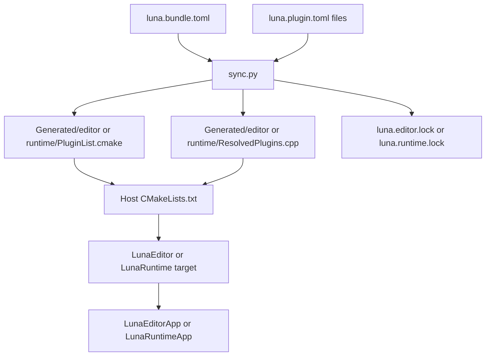
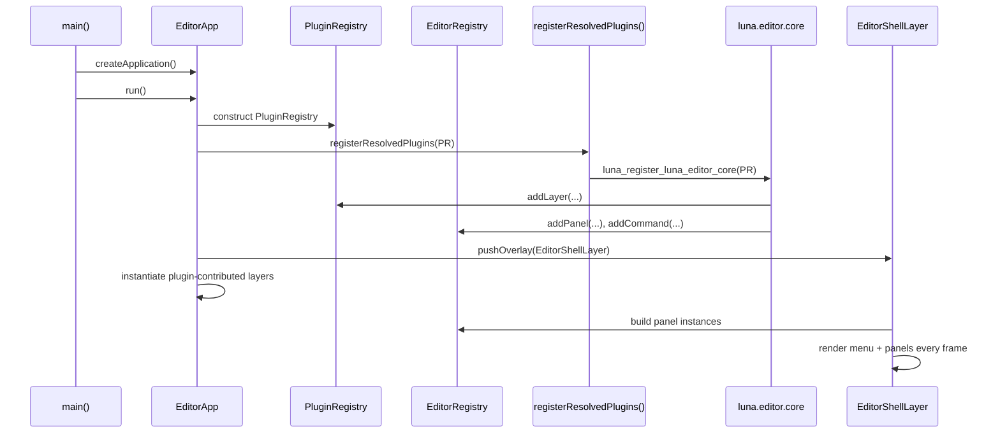

# Luna 插件系统手册

## 1. 文档范围

本文档描述的是 Luna 当前仓库里已经落地的插件系统骨架，而不是未来的理想设计。

当前实现的关键词是:

- 本地源码插件
- Bundle 驱动的插件选择
- Python `sync.py` 生成构建文件
- CMake 接入插件目标
- 宿主启动时显式注册

当前没有实现的内容，例如 GitHub 下载、版本求解、二进制插件、热重载、插件市场，不在本文档的“已实现能力”范围内。

## 2. 插件系统解决的问题

Luna 希望避免把所有编辑器功能、工具逻辑、工作流能力全部写死在一个单体应用里。

因此，当前插件系统要解决的核心问题不是“动态加载一个 DLL”，而是:

1. 让宿主程序根据 Bundle 决定启用哪些插件。
2. 让插件以源码形式参与当前工程构建。
3. 让插件通过显式注册，把自己的能力挂到宿主上。
4. 让同一套底层框架被组装成不同应用形态。

## 3. 当前系统中的几个核心术语

### 3.1 Host

宿主程序。

当前已经真正接入插件链路的宿主有两个:

- 编辑器宿主 `LunaEditorApp`
- 运行时宿主 `LunaRuntimeApp`

### 3.2 Plugin

一个带 manifest、带 CMake、带源码目录的本地源码模块。

插件现在最重要的特征有两个:

- 有 `luna.plugin.toml`
- 有一个显式注册入口函数

### 3.3 Bundle

一份决定“启用哪些插件”的清单。

当前默认 Bundle 有两份:

```text
Bundles/EditorDefault/luna.bundle.toml
Bundles/RuntimeDefault/luna.bundle.toml
```

### 3.4 Generated Files

`sync.py` 根据 Bundle 和插件 manifest 生成出来的构建与注册中间文件。

当前包括:

- `Plugins/Generated/editor/PluginList.cmake`
- `Plugins/Generated/editor/ResolvedPlugins.h`
- `Plugins/Generated/editor/ResolvedPlugins.cpp`
- `Plugins/Generated/runtime/PluginList.cmake`
- `Plugins/Generated/runtime/ResolvedPlugins.h`
- `Plugins/Generated/runtime/ResolvedPlugins.cpp`
- `luna.editor.lock`
- `luna.runtime.lock`

### 3.5 Contribution

插件注册给宿主的能力。

按当前实现，已经支持的贡献类型是:

- Layer
- Overlay
- Editor Panel
- Editor Command

其中:

- `Layer` / `Overlay` 可用于 runtime host 和 editor host
- `Editor Panel` / `Editor Command` 只属于 editor host

## 4. 当前目录布局

当前插件系统相关目录如下:

```text
Luna/
├─ Bundles/
│  ├─ EditorDefault/
│  │  └─ luna.bundle.toml
│  └─ RuntimeDefault/
│     └─ luna.bundle.toml
├─ Plugins/
│  ├─ builtin/
│  │  ├─ luna.editor.core/
│  │  │  ├─ luna.plugin.toml
│  │  │  ├─ CMakeLists.txt
│  │  │  └─ src/
│  │  ├─ luna.example.hello/
│  │  │  ├─ luna.plugin.toml
│  │  │  ├─ CMakeLists.txt
│  │  │  └─ src/
│  │  ├─ luna.example.imgui_demo/
│  │  │  ├─ luna.plugin.toml
│  │  │  ├─ CMakeLists.txt
│  │  │  └─ src/
│  │  └─ luna.runtime.core/
│  │     ├─ luna.plugin.toml
│  │     ├─ CMakeLists.txt
│  │     └─ src/
│  ├─ external/
│  └─ Generated/
│     ├─ editor/
│     │  ├─ PluginList.cmake
│     │  ├─ ResolvedPlugins.h
│     │  └─ ResolvedPlugins.cpp
│     └─ runtime/
│        ├─ PluginList.cmake
│        ├─ ResolvedPlugins.h
│        └─ ResolvedPlugins.cpp
├─ Tools/
│  └─ luna/
│     └─ sync.py
├─ Editor/
│  ├─ EditorApp.*
│  ├─ EditorRegistry.*
│  ├─ EditorPanel.h
│  └─ EditorShellLayer.*
├─ Runtime/
│  └─ RuntimeApp.*
└─ Luna/
   └─ Plugin/
      ├─ PluginRegistry.*
      ├─ PluginBootstrap.h
      └─ ServiceRegistry.h
```

## 5. 当前系统的职责分层

### 5.1 `Luna/Plugin/`

这一层是运行时插件基础设施。

主要对象:

- `ServiceRegistry`
- `PluginRegistry`
- `PluginBootstrap`

职责:

- 持有运行时服务
- 收集插件注册的 Layer / Overlay
- 向宿主暴露统一注册入口

### 5.2 `Editor/`

这一层是“编辑器宿主框架”，不是某个具体插件。

主要对象:

- `EditorRegistry`
- `EditorPanel`
- `EditorShellLayer`
- `EditorApp`

职责:

- 定义编辑器侧可扩展接口
- 管理 Panel / Command 的注册结果
- 创建编辑器壳并驱动这些贡献

### 5.3 `Runtime/`

这一层是运行时宿主框架。

当前主要对象:

- `RuntimeApp`

职责:

- 创建 runtime host
- 装配只依赖 `Layer` / `Overlay` 的 runtime plugins
- 不暴露 editor 专属扩展点

### 5.4 `Plugins/builtin/...`

这一层是具体插件实现。

当前已经有多个真正工作的内置插件:

- `luna.editor.core`
- `luna.example.hello`
- `luna.example.imgui_demo`
- `luna.runtime.core`

其中:

- `luna.editor.core` 负责默认编辑器基础能力
- `luna.example.hello` 是最小 Panel 示例插件
- `luna.example.imgui_demo` 是 Dear ImGui Demo 面板示例插件
- `luna.runtime.core` 负责最小 runtime Layer 示例

### 5.5 `Tools/luna/sync.py`

这是构建前的生成工具。

职责:

- 读取 Bundle
- 扫描插件 manifest
- 解析依赖
- 生成 CMake 插件接入清单
- 生成注册函数聚合文件
- 生成当前锁文件

## 6. 构建期工作流

当前构建期流程如下:



### 6.1 第一步: 读取 Bundle

当前默认 Bundle 文件是:

```text
Bundles/EditorDefault/luna.bundle.toml
Bundles/RuntimeDefault/luna.bundle.toml
```

它至少提供:

- `id`
- `name`
- `version`
- `sdk`
- `host`
- `[plugins].enabled`

当前 editor Bundle 内容表示:

- 宿主类型是 `editor`
- 启用插件列表里包含:
  - `luna.editor.core`
  - `luna.example.hello`
  - `luna.example.imgui_demo`

当前 runtime Bundle 内容表示:

- 宿主类型是 `runtime`
- 启用插件列表里包含:
  - `luna.runtime.core`

### 6.2 第二步: 扫描插件 manifest

`sync.py` 会扫描下面两个目录:

- `Plugins/builtin`
- `Plugins/external`

扫描规则很简单:

- 递归查找所有 `luna.plugin.toml`
- 读出 `id`、`cmake_target`、`entry`、`hosts`、`dependencies` 等字段
- 用 `id` 建一个插件表

### 6.3 第三步: 解析依赖

当前依赖解析是一个最小实现:

- 依赖来自 `dependencies` 表的 key
- 依赖值必须是字符串，但当前不会真正做版本求解
- 采用 DFS 拓扑排序
- 支持循环依赖检测
- 如果 Bundle 里引用了不存在的插件，会直接失败
- 如果插件声明的 `hosts` 不包含 Bundle 的 `host`，会直接失败

也就是说，当前 `dependencies` 的值更多是“格式保留位”，真正起作用的是依赖 key 本身。

### 6.4 第四步: 生成文件

`sync.py` 会生成四类文件。

#### 6.4.1 `PluginList.cmake`

作用:

- 告诉 CMake 需要 `add_subdirectory()` 哪些插件目录
- 告诉 `LunaEditor` 需要链接哪些插件 target

当前生成文件会按宿主分别写到:

- `Plugins/Generated/editor/PluginList.cmake`
- `Plugins/Generated/runtime/PluginList.cmake`

当前生成文件类似:

```cmake
set(LUNA_PLUGIN_TARGETS "")
if(NOT TARGET LunaBuiltinEditorCorePlugin)
    add_subdirectory("${PROJECT_SOURCE_DIR}/Plugins/builtin/luna.editor.core" "${PROJECT_BINARY_DIR}/plugins/luna_editor_core")
endif()
list(APPEND LUNA_PLUGIN_TARGETS LunaBuiltinEditorCorePlugin)
```

#### 6.4.2 `ResolvedPlugins.h/.cpp`

作用:

- 将所有选中的插件入口函数聚合在一个翻译单元里
- 避免运行时去做动态查找
- 保持插件注册顺序完全显式

当前生成结果的核心形式是:

```cpp
extern "C" void luna_register_luna_editor_core(luna::PluginRegistry& registry);

void registerResolvedPlugins(PluginRegistry& registry)
{
    luna_register_luna_editor_core(registry);
}
```

#### 6.4.3 lock file

作用:

- 记录这次 `sync.py` 解析出来的插件快照
- 作为当前工作区的“已解析结果摘要”

当前 editor host 和 runtime host 分别生成:

- `luna.editor.lock`
- `luna.runtime.lock`

它们还不是完整 lock system，因为它们没有记录 Git revision、来源 URL、校验信息。

#### 6.4.4 这些文件不是手写配置

当前原则是:

- `Bundle` 和 `plugin manifest` 是手写输入
- `Generated` 目录和 lock file 是工具输出

因此不要手工维护 `Plugins/Generated/*.cmake` 或 `ResolvedPlugins.cpp`。

### 6.5 当前需要手工执行 `sync.py`

当前顶层 `CMakeLists.txt` 不会在配置阶段自动帮你执行 `sync.py`。

因此当前推荐流程是先手工同步插件解析结果，再做 CMake 配置与编译:

```powershell
python Tools\luna\sync.py --project-root . --bundle Bundles/EditorDefault/luna.bundle.toml --generated-dir Plugins/Generated/editor --lock-file luna.editor.lock
cmake -S . -B build
cmake --build build --config Debug --target LunaEditorApp
```

如果你要同步 runtime host，则执行:

```powershell
python Tools\luna\sync.py --project-root . --bundle Bundles/RuntimeDefault/luna.bundle.toml --generated-dir Plugins/Generated/runtime --lock-file luna.runtime.lock
cmake -S . -B build
cmake --build build --config Debug --target LunaRuntimeApp
```

如果你改了 Bundle 或任意 `luna.plugin.toml`，就需要重新执行对应 host 的 `sync.py`，否则对应的 `Plugins/Generated/<host>` 和 lock file 不会刷新。

## 7. 运行时工作流

当前 editor host 的运行时流程如下:



### 7.1 `main()` 只知道宿主

`Luna/Core/Main.cpp` 并不知道有哪些插件。

它只做:

- 初始化日志
- 调用 `createApplication()`
- 初始化应用
- 进入主循环

### 7.2 `EditorApp::onInit()` 是插件装配入口

当前编辑器宿主在初始化时会做三件关键事:

1. 创建 `PluginRegistry`
2. 调用 `registerResolvedPlugins(plugin_registry)`
3. 根据注册结果组装 `EditorShellLayer` 与 Layer 贡献

这意味着:

- 插件不是直接操作 `main()`
- 插件也不是自己 new 一个宿主
- 宿主统一控制“何时注册、何时装配”

### 7.3 `registerResolvedPlugins()` 只是一个聚合函数

它本身不包含插件逻辑。

它只是把各个插件的注册入口按顺序调起来。

### 7.4 插件注册阶段不等于对象实例化阶段

当前实现里这两者是分开的:

- 插件先在注册阶段提交工厂函数、面板定义、命令定义
- 宿主随后再根据这些注册信息创建真正的对象

这样做的好处是:

- 宿主统一掌控对象生命周期
- 插件只负责声明贡献，不负责接管应用骨架
- 后面更容易继续加依赖、顺序、过滤和调试能力

### 7.5 `RuntimeApp::onInit()` 也是插件装配入口

runtime 宿主会做两件关键事:

1. 创建不带 `EditorRegistry` 的 `PluginRegistry`
2. 调用 `registerResolvedPlugins(plugin_registry)` 并实例化 runtime Layer / Overlay

当前 runtime host 不提供 editor 专属的 Panel / Command 扩展点。

## 8. 当前三个核心注册表

### 8.1 `ServiceRegistry`

职责:

- 提供一个按类型索引的服务容器
- 支持 `emplace`、`add`、`get`、`has`

当前特点:

- 结构已经存在
- 还没有太多真实 service 接进去
- 当前 builtin editor plugin 没有实际用到它

它的意义更偏“为后续插件共享运行时对象预留基础设施”。

### 8.2 `PluginRegistry`

职责:

- 暴露插件可注册的核心运行时接口
- 当前主要支持 Layer / Overlay 贡献
- 持有对 `ServiceRegistry` 和可选 `EditorRegistry` 的访问入口

当前已经支持:

- `addLayer(id, factory)`
- `addOverlay(id, factory)`
- `editor()`
- `services()`

当前不支持:

- Render feature registry
- Asset importer registry
- Project template registry
- Inspector registry
- Toolbar registry
- Menu registry

这些都还没有做出来。

### 8.3 `EditorRegistry`

这是编辑器宿主框架提供的扩展点容器。

当前已经支持:

- `addPanel(...)`
- `addCommand(...)`
- `invokeCommand(...)`

也就是说，当前编辑器插件主要可以做两类事:

- 给编辑器加一个 Panel
- 给编辑器加一个 Command

runtime host 当前没有单独的 `RuntimeRegistry`，因此它目前主要复用 `PluginRegistry` 里的 `Layer` / `Overlay` 贡献能力。

## 9. `EditorShellLayer` 是当前编辑器插件系统的中枢

`EditorShellLayer` 的职责非常关键。

它不是某个插件，而是宿主里专门用于承载编辑器扩展点的那一层。

当前它负责:

- 在 `onAttach()` 时根据 `EditorRegistry` 创建 Panel 实例
- 在 `onDetach()` 时销毁这些 Panel
- 在 `onImGuiRender()` 中渲染主菜单栏
- 通过 `Panels` 菜单开关 Panel 可见性
- 通过 `Commands` 菜单触发已注册命令

这意味着当前架构已经明确地把“编辑器宿主框架”和“具体插件功能”分开了:

- `EditorShellLayer` 负责承载
- 插件负责贡献

## 10. 当前 builtin plugins 是怎么接进来的

当前 editor Bundle 里接入的 builtin plugins 是:

```text
Plugins/builtin/luna.editor.core
Plugins/builtin/luna.example.hello
Plugins/builtin/luna.example.imgui_demo
```

它们都是独立参与构建的插件目标，而不是 `Editor/` 目录里的普通源文件。

其中 `luna.editor.core` 的注册函数会提交:

- 一个相机控制 Layer
- 一个 `Renderer` Panel
- 一个 `Reset Camera` Command

`luna.example.hello` 会提交一个最小 `Hello` Panel。

`luna.example.imgui_demo` 会提交一个 `ImGui Demo` Panel，用来控制并显示 Dear ImGui 的 Demo 窗口。

当前 runtime Bundle 里接入的 builtin plugin 是:

```text
Plugins/builtin/luna.runtime.core
```

它会提交一个 runtime Layer，用来演示 runtime host 下不依赖 editor 接口的插件装配方式。

这说明当前插件系统已经不是“假文档、真硬编码”，而是 editor / runtime 两条最小链路都已经打通。

## 11. 当前插件编译与链接关系

当前编辑器相关 target 分成两层:

### 11.1 `LunaEditorFramework`

这是给编辑器插件依赖的宿主框架库。

它提供:

- `EditorPanel`
- `EditorRegistry`
- `EditorShellLayer`

编辑器插件应当依赖它，而不是把自己的逻辑塞回 `Editor/` 目录。

### 11.2 `LunaEditor`

这是最终编辑器宿主库。

它负责:

- 定义 `EditorApp`
- 包含生成出来的 `ResolvedPlugins.cpp`
- 链接所有选中的插件目标

### 11.3 `LunaEditorApp`

这是最终可执行程序。

### 11.4 `LunaRuntime`

这是最终运行时宿主库。

它负责:

- 定义 `RuntimeApp`
- 包含 runtime host 生成出来的 `ResolvedPlugins.cpp`
- 链接所有选中的 runtime 插件目标

### 11.5 `LunaRuntimeApp`

这是最终运行时可执行程序。

## 12. 当前 manifest 字段中哪些真的起作用

当前 `luna.plugin.toml` 里常见字段包括:

- `id`
- `name`
- `version`
- `sdk`
- `kind`
- `cmake_target`
- `entry`
- `hosts`
- `dependencies`

但它们的“实际作用程度”目前并不一样:

| 字段 | 当前作用 |
| --- | --- |
| `id` | 真正参与解析，必须唯一 |
| `cmake_target` | 真正参与 CMake 生成 |
| `entry` | 真正参与 `ResolvedPlugins.cpp` 生成 |
| `hosts` | 真正参与 Bundle host 校验 |
| `dependencies` 的 key | 真正参与依赖拓扑排序 |
| `dependencies` 的 value | 当前只校验是字符串，还不做版本求解 |
| `sdk` | 当前写入 lock file，但不做严格兼容校验 |
| `kind` | 当前主要是记录信息，没有驱动分支逻辑 |

这个区别非常重要，写插件时不要误以为所有字段都已经完整生效。

## 13. 当前 Bundle 字段中哪些真的起作用

当前 `luna.bundle.toml` 里:

- `host` 会影响 host 兼容校验
- `[plugins].enabled` 会决定最终启用哪些插件

其他字段目前主要是元数据保留位。

## 14. 当前系统的优点

当前这版骨架已经具备几个非常重要的优点:

### 14.1 注册顺序显式

没有依赖静态初始化魔法，所有插件入口都汇总到 `ResolvedPlugins.cpp`。

### 14.2 构建图透明

插件通过 `PluginList.cmake` 明确加入构建图，不是偷偷混进宿主源码。

### 14.3 宿主和插件边界开始清晰

- `Editor/` 是宿主框架
- `Plugins/...` 是具体插件

### 14.4 未来可渐进扩展

当前这条链路已经足够支撑后续新增:

- RenderRegistry
- AssetRegistry
- Project template
- 更多 host 类型

## 15. 当前系统的局限

当前局限同样需要明确认识:

### 15.1 还不是完整包管理系统

`sync.py` 只扫描本地目录，不负责:

- clone GitHub 仓库
- 更新插件版本
- 缓存远程依赖

### 15.2 还没有版本求解器

依赖版本字符串现在没有真正参与求解。

### 15.3 还没有丰富扩展点

当前只有:

- Layer / Overlay
- Editor Panel
- Editor Command

### 15.4 多宿主已经落地，但 runtime 仍是轻量版本

当前已经有:

- `editor` 宿主链路
- `runtime` 宿主链路

但当前 runtime host 还是轻量版本，因为底层应用生命周期仍然共享同一套 ImGui 初始化与渲染框架。

## 16. 当前推荐的使用姿势

基于当前实现，推荐的工作方式是:

1. 把编辑器具体功能写成 `Plugins/builtin/...` 或 `Plugins/external/...`
2. 用 `luna.plugin.toml` 描述插件元数据
3. 把插件加入某个 Bundle 的 `[plugins].enabled`
4. 对 editor host 或 runtime host 手工执行对应的 `python Tools/luna/sync.py --project-root . --bundle ... --generated-dir ... --lock-file ...`
5. 再执行 CMake 配置与构建

不要手工维护 `Plugins/Generated` 目录。

## 17. 当前一句话结论

Luna 当前插件系统已经实现的本质是:

> 用 Bundle 选择插件，用 `sync.py` 生成构建与注册中间文件，用宿主在启动时显式注册插件贡献，再由宿主框架统一承载这些贡献。

这已经足够作为下一阶段继续演进的可靠骨架，但它还远不是完整生态系统。
