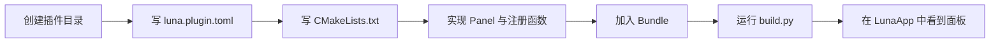
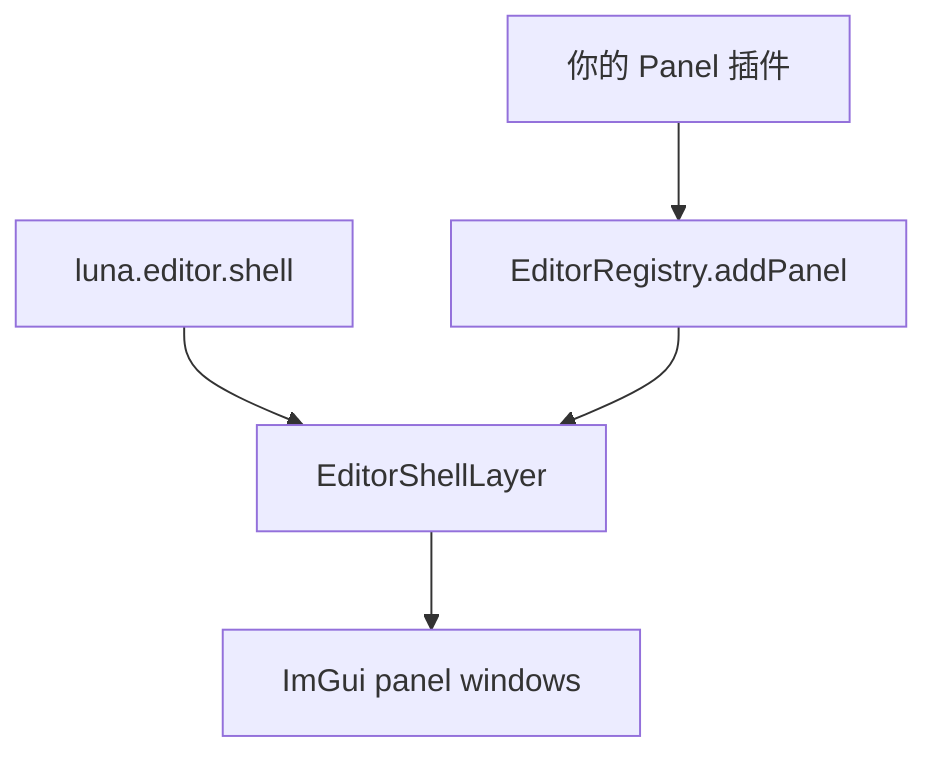

# 编写你的第一个 Luna 插件

> **提示 (Note):**
> 本文档讲的是“按当前仓库状态，写一个真正能工作的插件”。
> 目标不是抽象讲插件理论，而是把你从目录创建、manifest、CMake、注册函数一路带到能在 `LunaApp` 里看到结果。

## 1. 先选一个合适的插件目标

如果你是第一次写 Luna 插件，最推荐的入门目标不是渲染主路径，而是下面三类:

| 插件类型 | 当前推荐度 | 说明 |
| --- | --- | --- |
| Editor Panel | 很高 | 最容易验证，也最能体现插件装配价值 |
| Editor Command | 很高 | 逻辑简单，生命周期最清晰 |
| Runtime Layer | 高 | 适合做运行时行为与交互演示 |

当前**不推荐**把第一个插件做成:

- RenderGraph 深度注入插件
- RenderPass 注入插件
- 远程下载插件
- 二进制插件

原因很简单: 这些扩展点当前还没有正式协议。

## 2. 本文示例会做什么

本文会带你做一个最小 editor panel 插件:

- 插件 id: `com.example.hello_panel`
- 贡献一个 `Hello Panel`
- 加入 editor bundle
- 通过 `build.py` 编译
- 启动后在 editor shell 中看到面板



## 3. 先理解一条现实边界

Panel 插件要真正显示出来，需要的不只是 ImGui 本身，还需要 editor shell 负责承载窗口。

所以当前 editor panel 插件应当依赖:

- `luna.editor.shell`

而不是只依赖:

- `luna.imgui`

`luna.imgui` 只是一个“请求启用 ImGui”的通用插件。  
它本身不会替你创建 `Panels` 菜单，也不会替你实例化 `EditorPanel`。

## 4. 创建目录结构

建议先建成下面这样:

```text
Plugins/
└─ external/
   └─ com.example.hello_panel/
      ├─ luna.plugin.toml
      ├─ CMakeLists.txt
      └─ src/
         ├─ HelloPanel.h
         ├─ HelloPanel.cpp
         └─ HelloPanelPlugin.cpp
```

如果你就是要做仓库内置插件，也可以放到 `Plugins/builtin/`。  
但作为第一次练手，放进 `Plugins/external/` 更不容易和现有 builtin 插件混淆。

## 5. 编写 `luna.plugin.toml`

把 manifest 写成下面这样:

```toml
id = "com.example.hello_panel"
name = "Hello Panel"
version = "0.1.0"
sdk = "0.1"
kind = "editor"
cmake_target = "ComExampleHelloPanelPlugin"
entry = "luna_register_com_example_hello_panel"
hosts = ["app"]

[dependencies]
"luna.editor.shell" = "0.1"
```

### 5.1 逐字段说明

| 字段 | 作用 |
| --- | --- |
| `id` | 插件唯一标识，不能和仓库内任何其他插件重复 |
| `name` | 显示用名字 |
| `version` | 插件版本，当前主要写入 lock file |
| `sdk` | 面向的 Luna SDK 版本，当前还没有严格兼容求解 |
| `kind` | 插件类别，建议 editor 插件写 `editor` |
| `cmake_target` | 插件静态库 target 名 |
| `entry` | 插件入口函数名，必须和 C++ 代码保持一致 |
| `hosts` | 当前宿主兼容列表；对当前仓库应写 `["app"]` |
| `[dependencies]` | 依赖插件清单；这里依赖 `luna.editor.shell` |

### 5.2 为什么依赖 `luna.editor.shell`

因为当前 panel 插件显示链路是:



没有 `luna.editor.shell`，你的 panel 定义即使注册成功，也没有人负责把它变成真正的窗口。

## 6. 编写 `CMakeLists.txt`

```cmake
add_library(
    ComExampleHelloPanelPlugin
    STATIC
    luna.plugin.toml
    src/HelloPanel.h
    src/HelloPanel.cpp
    src/HelloPanelPlugin.cpp
)

target_include_directories(
    ComExampleHelloPanelPlugin
    PUBLIC
        ${PROJECT_SOURCE_DIR}
        ${CMAKE_CURRENT_SOURCE_DIR}/src
)

target_link_libraries(
    ComExampleHelloPanelPlugin
    PUBLIC
        LunaEditorFramework
)
```

### 6.1 为什么 editor 插件链接 `LunaEditorFramework`

因为当前 editor 扩展协议都定义在这个框架库里，包括:

- `EditorPanel`
- `EditorRegistry`
- `EditorShellLayer` 的运行时承载协议

如果你写的是纯 runtime 插件，不依赖 editor 接口，那么链接 `LunaCore` 就够了。

## 7. 实现 Panel 类

### 7.1 `HelloPanel.h`

```cpp
#pragma once

#include "Editor/EditorPanel.h"

namespace example {

class HelloPanel final : public luna::editor::EditorPanel {
public:
    void onImGuiRender() override;
};

} // namespace example
```

### 7.2 `HelloPanel.cpp`

```cpp
#include "HelloPanel.h"

#include "imgui.h"

namespace example {

void HelloPanel::onImGuiRender()
{
    ImGui::TextUnformatted("Hello from com.example.hello_panel");
}

} // namespace example
```

### 7.3 当前 `EditorPanel` 的最小生命周期

| 方法 | 是否必须 | 作用 |
| --- | --- | --- |
| `onAttach()` | 可选 | 面板实例被创建后调用 |
| `onDetach()` | 可选 | 面板销毁前调用 |
| `onImGuiRender()` | 必须 | 绘制窗口内容 |

## 8. 实现插件注册函数

### 8.1 `HelloPanelPlugin.cpp`

```cpp
#include "HelloPanel.h"

#include "Editor/EditorRegistry.h"
#include "Plugin/PluginRegistry.h"

extern "C" void luna_register_com_example_hello_panel(luna::PluginRegistry& registry)
{
    if (!registry.hasEditorRegistry()) {
        return;
    }

    registry.editor().addPanel<example::HelloPanel>(
        "com.example.hello_panel.panel",
        "Hello Panel",
        true);
}
```

### 8.2 为什么要写 `extern "C"`

因为 `sync.py` 会把 manifest 里的 `entry` 直接写到 `ResolvedPlugins.cpp` 中。

使用 `extern "C"` 的好处是:

- 避免 C++ 名字改编
- 入口名保持稳定
- 和 generated 代码直接一一对应

### 8.3 为什么要检查 `hasEditorRegistry()`

当前 `LunaApp` 默认会创建 `EditorRegistry`，但这个检查仍然值得保留:

- 它表达了“这是 editor 扩展”的意图
- 为后续更明确的宿主区分保留兼容空间

## 9. 把插件加入 Bundle

编辑:

```text
Bundles/EditorDefault/luna.bundle.toml
```

把你的插件 id 加进 `[plugins].enabled`:

```toml
[plugins]
enabled = [
  "luna.editor.shell",
  "luna.editor.core",
  "luna.example.hello",
  "luna.example.imgui_demo",
  "com.example.hello_panel",
]
```

## 10. 生成并构建

当前最推荐的方式是直接使用构建工具:

```powershell
python Tools\luna\build.py editor
```

它会自动完成:

1. 解析 Bundle
2. 扫描插件 manifest
3. 生成 `PluginList.cmake`、`ResolvedPlugins.*`、`luna.lock`
4. 配置 CMake
5. 构建 `LunaApp`

### 10.1 如果你只想先验证生成

```powershell
python Tools\luna\build.py editor --sync-only
```

### 10.2 如果你坚持手工走底层流程

```powershell
python Tools\luna\sync.py --project-root . --bundle Bundles/EditorDefault/luna.bundle.toml
cmake -S . -B build -DLUNA_GENERATED_DIR="${PWD}/Plugins/Generated"
cmake --build build --config Debug --target LunaApp
```

## 11. 运行后怎么验证

启动 editor profile:

```powershell
.\build\profiles\editor\App\Debug\LunaApp.exe
```

验证路径:

1. 看窗口顶部是否出现 editor 主菜单栏。
2. 打开 `Panels` 菜单。
3. 确认 `Hello Panel` 出现在列表中。
4. 打开后确认窗口里显示 `Hello from com.example.hello_panel`。

## 12. 如果你想做一个 Runtime Layer 插件

Runtime 插件要简单得多，因为它不依赖 editor shell。

### 12.1 最小注册函数

```cpp
extern "C" void luna_register_com_example_runtime(luna::PluginRegistry& registry)
{
    registry.addLayer("com.example.runtime.layer", [] {
        return std::make_unique<MyRuntimeLayer>();
    });
}
```

### 12.2 什么时候适合写 Runtime Layer

适合:

- 相机或输入逻辑
- 调试动画
- 运行时行为验证
- clear color、相机位置、调试参数等状态修改

## 13. 当前插件能碰 renderer 到什么程度

### 13.1 当前可以做的

插件里的 `Layer` / `Panel` 可以直接访问 renderer 状态:

```cpp
auto& renderer = luna::Application::get().getRenderer();
auto& color = renderer.getClearColor();
color.x = 0.2f;
```

这足够做:

- 相机控制
- clear color 调整
- 读取 renderer 统计和状态

### 13.2 当前不要试图做的

不要把第一个插件写成下面这些东西:

- RenderGraph builder 注入
- RenderPass 注册
- 活动宿主 RenderGraph 替换

因为当前正式注入点仍然在宿主 `Application` 初始化阶段，而不是插件注册阶段。

## 14. 常见错误

| 现象 | 原因 | 解决方式 |
| --- | --- | --- |
| `entry` 找不到 | manifest 与函数名不一致 | 让 `entry` 与 `extern "C"` 函数完全一致 |
| 插件目录存在但没有生效 | 没加入 Bundle | 把插件 id 写进 `[plugins].enabled` |
| Bundle 改了但构建还是旧的 | 没重新 sync | 重新运行 `build.py` 或 `sync.py` |
| Panel 注册了但界面没出现 | 没启用 `luna.editor.shell` | 给 panel 插件添加 shell 依赖并启用 |
| 链接时报 editor 相关符号缺失 | 没链接 `LunaEditorFramework` | 修正插件 CMake |

## 15. 真实示例应该看哪些目录

如果你希望对照当前仓库里的真实实现，优先看:

- `Plugins/builtin/luna.example.hello`
- `Plugins/builtin/luna.example.imgui_demo`
- `Plugins/builtin/luna.editor.core`
- `Plugins/builtin/luna.runtime.core`

## 16. 一句话总结

你写第一个 Luna 插件时，最稳妥的路径是:

> 先做一个 editor panel 或 runtime layer，把 manifest、CMake、注册函数、Bundle、`build.py` 这条链路跑通，再继续扩展更复杂的能力。
